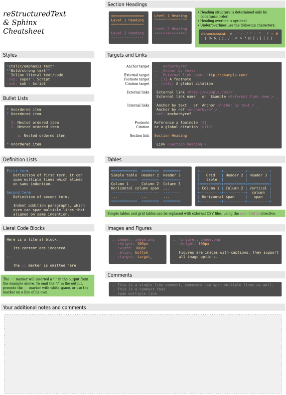
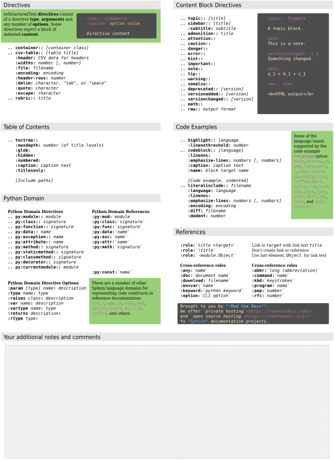

Cheat Sheet
###########

We have made a cheat sheet for helping you remember the syntax for
reStructuredText & Sphinx programs.
The basic :duuser:`reStructuredText Cheat Sheet <cheatsheet>` could
also be very helpful.

.. -------------------- FORCE NEW PAGE --------------------- BEGIN --

.. only:: latex

   .. raw:: latex

      \clearpage\phantomsection

.. -------------------- FORCE NEW PAGE --------------------- END ----

.. ------------------------- FIGURE ------------------------- BEGIN --

.. _cheat-sheet-rst-sphinx-front:

   *Cheat Sheet* **reStructuredText & Sphinx 1/2**

.. only:: latex

   .. raw:: latex

      \FloatBarrier

.. ------------------------- FIGURE ------------------------- END ----

.. -------------------- FORCE NEW PAGE --------------------- BEGIN --

.. only:: latex

   .. raw:: latex

      \clearpage\phantomsection

.. -------------------- FORCE NEW PAGE --------------------- END ----

.. ------------------------- FIGURE ------------------------- BEGIN --

.. _cheat-sheet-rst-sphinx-back:

   *Cheat Sheet* **reStructuredText & Sphinx 2/2**

.. only:: latex

   .. raw:: latex

      \FloatBarrier

.. ------------------------- FIGURE ------------------------- END ----

.. Local variables:
   coding: utf-8
   mode: text
   mode: rst
   End:
   vim: fileencoding=utf-8 filetype=rst :
