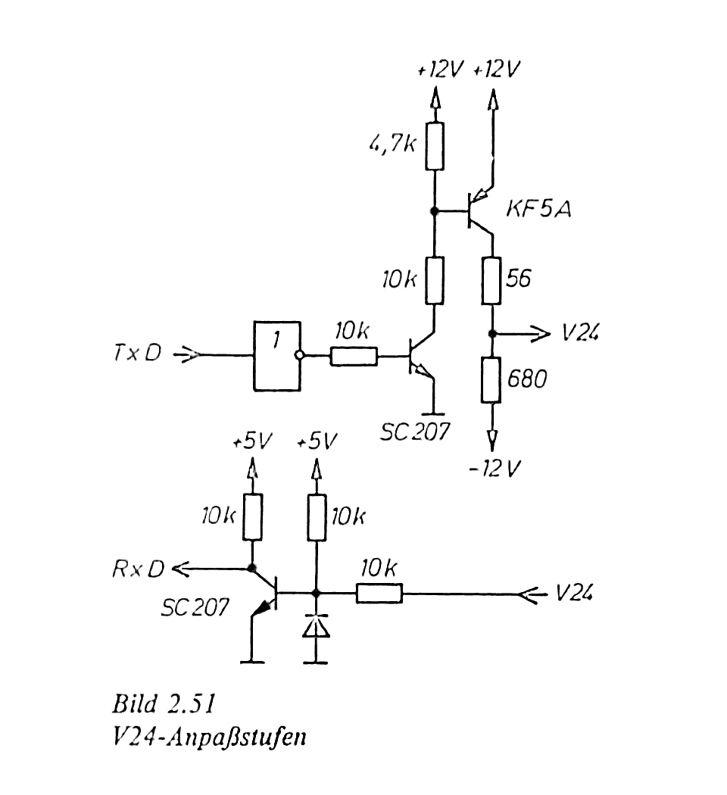

.. index:: pair: PC/M; Wandlerbaustein IFSS auf V.24

.. _kcsystems-mach-pcm-fa038805-k3:

Beschreibung Wandlerbaustein IFSS auf V.24
##########################################

Karl-Marx-Stadt, den 20.7.89

Um die Möglichkeiten des im |FA| Jahrgang 1988 veröffentlichten |PC/M| Computers mit seinem |SCP| kompatiblen Betriebssystem umfassender nutzen zu können, wurde nach Möglichkeiten der problemlosen Programmübertragung vom |PC/M| auf Rechner beliebiger Hersteller und umgekehrt gesucht. Auf der von mir aufgebauten |ZVE| (Leiterplattenstand 8/88) wurden anfangs beide |IFSS| Schnittstellen bestückt, später kam der Wunsch nach einer möglichst einfachen Umrüstung auf die wahrscheinlich gebräuchlichere |V.24| auf. Da ich die |IFSS| Schnittstellen über den genormten 10 poligen Steckverbinder an der Rückwand des Rechners herausgeführt hatte, nutzte ich die dort offengebliebenen 5 Kontakte zum Herausführen der benötigten Betriebsspannungen :signal:`5P`, :signal:`12P` und :signal:`12N`. Die je zwei Datenleitungen (Sender 2x und Empfänger 2x) wurden über Optokoppler wieder auf TTL Pegel umgesetzt, die Schaltung zur Erzeugung der bei |V.24| üblichen Pegel von |+-| 12 V entnahm ich aus :cite:`pcm:erlekampf1988mikroelektronik`, Seite 102. Der Aufbau ist unproblematisch, er erfolgte bei mir auf einer Universalleiterplatte in den Maßen 30 |x| 40 |mm| mit aufgeschraubten Steckverbindern. Er wird auf den herausgeführten |IFSS| Steckverbinder aufgesteckt, anschließend kann mit Geräten, die mit |V.24| oder |RS232C| ausgerüstet sind, gearbeitet werden. Der Vorteil liegt auf der Hand, eine Umrüstung ist in Sekunden und ohne Eingriff in die Hardware des Rechners möglich. Auf die verbleibenden 2 Kontakte können Statussignale der |SIO| für die Synchronisation langsamer Peripherie geschaltet werden. Es ergab sich bei mir folgende Steckerleistenbelegung:

.. tabularcolumns:: p{0.05\linewidth}p{0.20\linewidth}p{0.05\linewidth}p{0.2\linewidth}
.. table:: |PC/M| |IFSS| auf |V.24| - Steckerleistenbelegung
   :name: kcsystems-mach-pcm-tabelle-1-k3
   :widths: 10, 40, 10, 40
   :class: longtable
   :align: center
   :width: 50%

   +------------+-----------------+------------+---------------+
   | :pin:`A1`: | :signal:`SD-`   | :pin:`B1`: | :signal:`CTS` |
   +------------+-----------------+------------+---------------+
   | :pin:`A2`: | :signal:`DTR`   | :pin:`B2`: | :signal:`SD+` |
   +------------+-----------------+------------+---------------+
   | :pin:`A3`: | :signal:`ED+`   | :pin:`B3`: | :signal:`12P` |
   +------------+-----------------+------------+---------------+
   | :pin:`A4`: | :signal:`12N`   | :pin:`B4`: | :signal:`ED-` |
   +------------+-----------------+------------+---------------+
   | :pin:`A5`: | :signal:`Masse` | :pin:`B5`: | :signal:`5P`  |
   +------------+-----------------+------------+---------------+

.. rubric:: Schaltung:

   |PC/M| |IFSS| auf |V.24| - Schaltung aus :cite:`pcm:erlekampf1988mikroelektronik`, Seite 102

Genutzt wird der Modul zur Zeit im Zusammenspiel mit einem Computerkommunikationsprogramm, das zum TLC von ROBOTRON kompatibel ist und somit einen beiderseitigen Programmaustausch zwischen unterschiedlichsten Rechnern möglich macht. Dieses Programm wurde der Programmsammlung für den |PC/M| zur Verfügung gestellt und ist dort nachnutzbar.

.. topic:: Hinweis auf Adresse für Nachnutzung

   +-----------------------------------------------------------+
   | | Uwe Beer                                                |
   +-----------------------------------------------------------+
   | **Anmerkung:** *Anschriften aus datenschutzrechtlichen*   |
   | *Gründen entfernt!*                                       |
   +-----------------------------------------------------------+

.. | | Otto-Schütze-Straße 46                                  |
.. | | 9071 Karl-Marx-Stadt                                    |
.. +-----------------------------------------------------------+

.. Local variables:
   coding: utf-8
   mode: text
   mode: rst
   End:
   vim: fileencoding=utf-8 filetype=rst :
