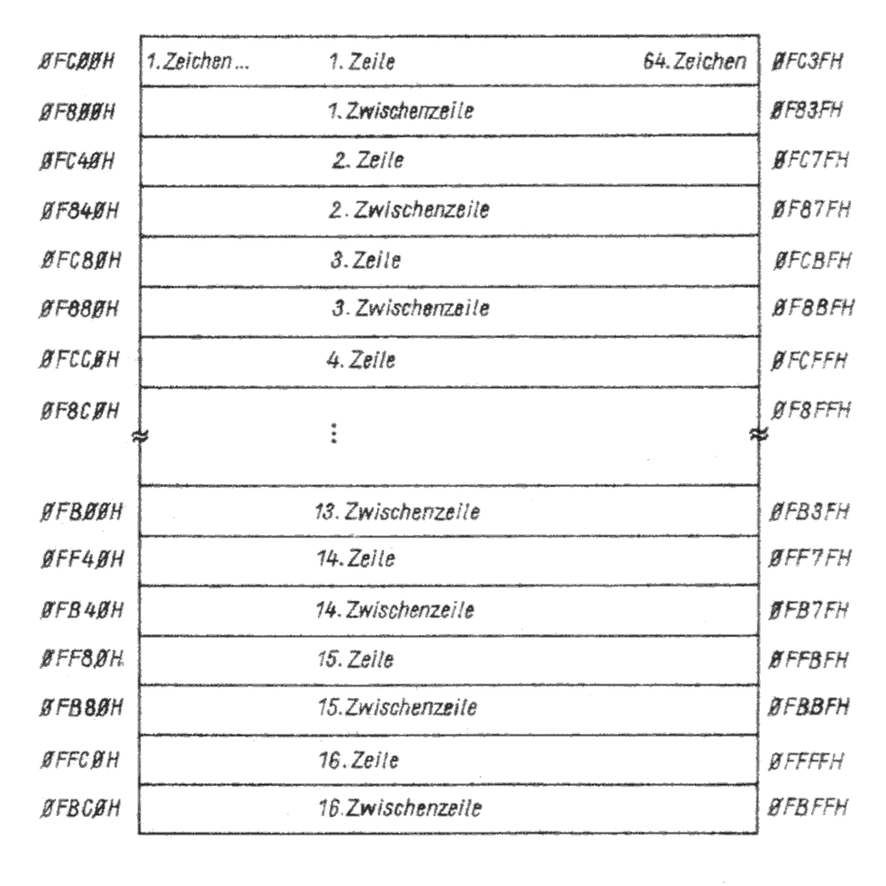
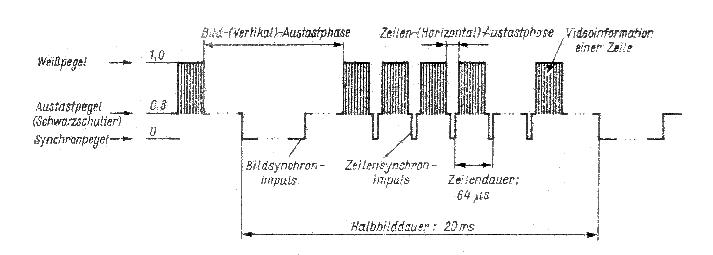

.. index:: pair: PC/M; Peripherie

Die Peripherie
##############

.. index:: triple: PC/M; Peripherie; Bildschirmansteuerung
.. index:: triple: PC/M; Peripherie; BSA

.. _kcsystems-mach-pcm-fa058804:

Bildschirmansteuerung (BSA)
***************************

Bei der vorliegenden |BSA| wurden 312 Zeilen mit einer Bildfolgefrequenz von 50 |Hz| (ohne Zeilensprung) realisiert. Dies ermöglicht die Darstellung von 32 Zeichenzeilen zu je 8 Fernsehzeilen. Außerdem dienen sieben dunkelgetastete Zeichenzeilen der Darstellung des oberen (3 Zeichenzeilen) sowie des unteren Bildrandes (4 Zeichenzeilen). Jede Zeichenzeile besteht aus 64 Zeichen zur Informationsdarstellung und 32 dunkelgetasteten Zeichen zur linken und rechten Bildranddarstellung (je 16 Zeichenpositionen). Im Normalfall werden zur Darstellung alphanumerischer Zeichen nur 16 Zeichenzeilen angesprochen, jede zweite Zeile bleibt dunkel, kann jedoch bei der Arbeit mit der möglichen Pseudografik genutzt werden. Es sind also 1024 bzw. bei Pseudografik 2048 Zeichen pro Bild darstellbar. Ein Zeichen besteht dabei aus einer 8x7 Punktmatrix. Die Adressbelegung der einzelnen Zeichenpositionen des Bildschirmes ist aus |PC_M_B12_N| ersichtlich. Da im Gegensatz zu einer "echten" Graphik die Zeichen bei dieser |BSA| fest kodiert vorliegen müssen, wird der gesamte Zeichensatz auf |EPROM| (Zeichengenerator) programmiert. Durch den Einsatz eines |U2716| (2 K x 8 Bit) lassen sich 256 unterschiedliche Zeichen darstellen.

   Adressen der Zeichenpositionen auf dem Bildschirm

Den Übersichtsplan der gesamten |BSA| zeigt |PC_M_B06_N|, den Stromlaufplan |PC_M_B07_N|). Über die Adressdekodierung (D114, D115.1) wird die Anfangsadresse des Bildschirms mit 0F800H festgelegt. Bei /RFSH = Low wird der Zugriff auf die |BSA| gesperrt. Das Ausgangssignal der Adressdekodierung schaltet bei Speicherzugriffen (/MREQ aktiv) über den Multiplexer (D104 bis D106) die |CPU| Adresse auf die Adresseingänge A0 bis A10 des Bildwiederholspeichers (|BWS|). Dieser wird durch vier IC's |U214| (D107 bis D110) gebildet und verfügt somit über eine Speicherkapazität von 2048 x 8 Bit. Im |BWS| wird immer ein komplettes Bild, d.h. die |ASCII| Kodierung der auf dem Bildschirm dargestellten Zeichen, abgespeichert. Da der Arbeitsspeicher (|RAM|) der zentralen Platine 64 |kB| umfasst, arbeiten der |BWS| und die letzten beiden |kB| des aktuellen |DRAM| Blockes parallel. Um Buskonflikte zu vermeiden wird der |BWS| nur beschrieben, das Lesen erfolgt vom |RAM| der zentralen Platine. Daher kann als Datentreiber (D111) die IC DS 8282 eingesetzt werden. Eine Datenrichtungsumschaltung ist für die |BSA| dadurch nicht erforderlich. Greift die |CPU| nicht auf die |BSA| zu, liegen die Adressen des Bildwiederholzählers (D123 bis D127) am |BWS|. Dieser realisiert unter anderem die Bereitstellung der Spalten- und Zeilenadressen bei der zyklischen Bildwiederholung.

.. index:: triple: PC/M; Stromlaufplan; FA 5/88-04 (BG)

.. list-table:: FA 5/88-04 (BG)
   :name: kcsystems-mach-pcm-fa058804-bg
   :class: longtable
   :align: center
   :width: 80 %
   :header-rows: 1

   * - FA 5/88-04 (BG)

   * - .. figure:: bild-06.png
          :name: kcsystems-mach-pcm-bild-06
          :figclass: align-center
          :align: center
          :width: 850 px
          :alt: Übersichtsplan der Bildschirmansteuerung

          Übersichtsplan der Bildschirmansteuerung

Den Bildpunkttakt erzeugt ein Quarzgenerator, der mit einer Frequenz von 10,5 |MHz| schwingt (D101). Hierbei ist durchaus der Einsatz eines Spulenoszillators möglich :cite:`pcm:heyder8385ac1`. D102 zählt die für eine Zeichenbreite notwendigen 7 Bildpunkte. Für die Darstellung alphanumerischer Zeichen ist der Zeichenzwischenraum im Zeichengenerator programmiert. Nach je 7 Bildpunkten wird der Bildwiederholzähler durch den Zeichentakt um 1 weitergeschaltet. D123 und D124 bilden dabei den Zeichenspaltenzähler, der die insgesamt 96 x 667,6 |ns| langen Zeichen zählt. Aus den Zählerständen werden die zur Zeichenspaltenadressierung notwendigen 6 Adressleitungen, der Zeilensynchronimpuls und die Zeichenaustastung erzeugt. Der sich anschließende Zeichenlinienzähler (D125) zählt die für eine Zeichenreihe notwendigen 8 Fernsehzeilen und erzeugt die Adressen A0 bis A2 für den Zeichengenerator D113. Nach der achten Fernsehzeile einer Zeichenreihe wird der durch die Zähler D126 und D127 gebildete Zeichenreihenzähler um 1 weitergeschaltet. An seinen Ausgängen stehen die 5 Adressen (32 Zeichenreihen) für den |BWS| an. Weiterhin wird über eine Dekodierung die Austastung der 7 Bildrandzeilen und die Generierung des Bildsynchronimpulses realisiert.

Der Zeichentakt wird weiterhin zur Übernahme der vom Zeichengenerator bereitgestellten 7 Bit Information in den Parallel-Serien-Wandler (Register D119 und D120) benötigt. Zwei Gatter des D103.1 erzeugen zusammen mit einer RC Kombination (Impulsverkürzung) zur Erzeugung den zur Übernahme erforderlichen H-Impuls. Nach der Übernahme des Bitmusters in die Register IC's D195 werden durch den Bildpunkttakt die 7 Bit aus dem Parallel-Serien-Wandler herausgeschoben. Diese stellen die Videoinformation dar.

.. index:: triple: PC/M; Stromlaufplan; FA 5/88-04 (SP)

.. list-table:: FA 5/88-04 (SP)
   :name: kcsystems-mach-pcm-fa058804-sp
   :class: longtable
   :align: center
   :width: 80 %
   :header-rows: 1

   * - FA 5/88-04 (SP)

   * - :raw-latex:`\begin{turn}{90}`
       :raw-latex:`\begin{minipage}[c][][c]{0.85\textheight}`

       .. figure:: bild-07.png
          :name: kcsystems-mach-pcm-bild-07
          :figclass: align-center
          :align: center
          :width: 850 px
          :alt: Stromlaufplan der Bildschirmansteuerung

          Stromlaufplan der Bildschirmansteuerung

       :raw-latex:`\end{minipage}`
       :raw-latex:`\end{turn}`

Der Zeichengenerator D113 liegt mit seinen Adresseingängen A3 bis A10 über das durch D112 realisierte Zeichenlatch an den Datenausgängen des |BWS|. A0 bis A2 liegen an den Ausgängen des Zeichenlinienzählers D125. Im Zeichengenerator ist entsprechend des an A3 bis A10 anliegenden |ASCII| Kodes das Bitmuster des entsprechenden Zeichens abgespeichert. A0, A1 und A2 bezeichnen dabei die aktuelle Fernsehzeile, in der sich der Elektronenstrahl gerade befindet. Die Grafiksymbole und Sonderzeichen sind in |PC_M_B10A_N| dargestellt. Der Zeichensatz ist so aufgebaut, dass die zweite Hälfte die Inversdarstellung der ersten 128 Zeichen realisiert. Dieser Umstand wird zur Darstellung des Cursors mittels Setzen von Bit7 genutzt. Prinzipiell besteht unter Beachtung von Zeichenaufbau (|PC_M_B11_N|) und Kodierung die Möglichkeit, eine Änderung des vorliegenden Zeichensatzes (z.B. spezielle Pseudografikelemente zur Lösung bestimmter Aufgaben), vorzunehmen. Die verwendeten Pseudografikelemente bestehen aus je vier Feldern. Daraus ergibt sich die Möglichkeit der Darstellung von 16 Grafiksymbolen, wobei sich 8 der Symbole wiederum durch Inversdarstellung der Symbole der Kodierung ab 00H ergeben und somit ab Kode 80H liegen. Neben diesen 16 Grafiksymbolen wurden im Zeichensatz noch spezielle Symbole geschaffen, welche z.B. der Darstellung von Schaltzeichen und Ablaufgraphen dienen können. Weiterhin sind die Umlaute programmiert.

.. index:: triple: PC/M; Zusatzdaten; FA 5/88-04 (ZD/2)

.. list-table:: FA 5/88-04 (ZD/2)
   :name: kcsystems-mach-pcm-fa058804-zd2
   :class: longtable
   :align: center
   :width: 80 %
   :header-rows: 1

   * - Darstellung
     - Aufbau

   * - :raw-latex:`\begin{minipage}[c][][c]{0.45\textwidth}`

       .. figure:: bild-10a.png
          :name: kcsystems-mach-pcm-bild-10a
          :figclass: align-center
          :align: center
          :width: 320 px
          :alt: Darstellung der im Zeichengenerator generierten Grafiksymbole und Sonderzeichen

          Darstellung der im Zeichengenerator generierten Grafiksymbole und Sonderzeichen

       :raw-latex:`\end{minipage}`

     - :raw-latex:`\begin{minipage}[c][][c]{0.45\textwidth}`

       .. figure:: bild-11.png
          :name: kcsystems-mach-pcm-bild-11
          :figclass: align-center
          :align: center
          :width: 320 px
          :alt: Aufbau von alphanumerischen Zeichen und Grafiksymbolen

          Aufbau von alphanumerischen Zeichen und Grafiksymbolen

       :raw-latex:`\end{minipage}`

Die beiden IC's D195 (D119, D120) arbeiten als Parallel-Serien-Wandler. Entsprechend der Adressierung durch den jeweiligen Zeichenkode liegt die aktuelle Bildpunktinformation einer Zeile des darzustellenden Zeichens an den Datenausgängen des Zeichengenerators und somit an den parallelen Eingängen des Parallel-Serien-Wandlers an. Die 7 Bit Information wird synchron mit dem Bildpunkttakt seriell ausgegeben und vom |BAS| Mischer weiterverarbeitet. Der |BAS| Mischer vereint zur Erzeugung eines |BAS| Signals die Synchron- und Austastsignale mit der Videoinformation. Mit dem dem |BAS| Mischer zusätzlich zugeführten Bildpunkttakt wird realisiert, dass alle Zeichen aus gleichlangen Bildpunkten zusammengesetzt sind, die keine Helligkeitsunterschiede aufweisen.

Über die beiden Flip-Flop D117.1, D117.2 (DL 074) werden aus den Zählerständen die Zeilen- und Bildaustastsignale (Bildrahmen) gebildet. Der Dekoder IC DS 8205 (D118) liefert den Startimpuls für die Bildaustastung und generiert den Bildsynchronimpuls. Der monostabile Multivibrator (D103.2, D116) erzeugt dabei die konstante Länge von 150 us. Der durch die Gatter D103.3 und D121.1 gebildete Zeilensynchronimpuls wird gemeinsam mit dem Bildsynchronimpuls (D122.2) als Synchronsignal dem |BAS| Mischer zugeführt.

   Taktdiagramm BAS Signal

Das Ausgangssignal des |BAS| Mischers (D122) kann über den Transistor VT101 direkt in den TV Empfänger eingespeist werden. Zum Anschluss an den Antenneneingang wurde auf der |BSA| ein Modulator vorgesehen. Der Modulator muss zur Vermeidung von Störstrahlungen vollständig geschirmt sein.

Die hier beschriebene |BSA| ermöglicht die Darstellung von maximal 2048 Zeichen mittels eines handelsüblichen TV Gerätes. Durch die Austast- und Synchronimpulse wird die Darstellung der  beschreibbaren Bildfläche symmetrisch innerhalb des dunkelgetasteten Bildrahmens ermöglicht. Die 2048 Zeichen werden in 64 Spalten und 32 Reihen dargestellt. Im Zeichengenerator sind 256 alphanumerische und pseudografische Zeichen abgespeichert, die Kursordarstellung erfolgt über die Inversdarstellung des sich auf der aktuellen Bildschirmposition befindenden Zeichens. Die CCIR Norm wurde in Bezug auf Zeilen- und Bildfrequenz eingehalten, was die problemlose Anpassung an jeden TV Empfänger gewährleistet :cite:`pcm:quendt1985datensichtgeraet`, :cite:`pcm:sterl1979mikrorechnergesteuertes`, :cite:`pcm:autorenkollektiv1984z9001programmierhilfen`, :cite:`pcm:autorenkollektiv1985kc851anhangprogrammierhandbuch`, :cite:`pcm:autorenkollektiv1984bildschirmgeraetk8911`.

.. index:: triple: PC/M; PCB Layouts; FA 5/88-04 (BP)

.. list-table:: FA 5/88-04 (BP)
   :name: kcsystems-mach-pcm-fa058804-bp
   :class: longtable
   :align: center
   :width: 80 %
   :header-rows: 1

   * - FA 5/88-04 (BP)

   * - :raw-latex:`\begin{turn}{90}`
       :raw-latex:`\begin{minipage}[c][][c]{0.75\textheight}`

       .. figure:: bild-08c.png
          :name: kcsystems-mach-pcm-bild-08c
          :figclass: align-center
          :align: center
          :width: 850 px
          :alt: Bestückungsplan der Bildschirmansteuerung

          Bestückungsplan der Bildschirmansteuerung

       :raw-latex:`\end{minipage}`
       :raw-latex:`\end{turn}`

   * - .. figure:: bild-09.png
          :name: kcsystems-mach-pcm-bild-09
          :figclass: align-center
          :align: center
          :width: 400 px
          :alt: Bestückungsplan des Videomodulators

          Bestückungsplan des Videomodulators

.. index:: triple: PC/M; PCB Layouts; FA 5/88-04 (LS)

.. list-table:: FA 5/88-04 (LS)
   :name: kcsystems-mach-pcm-fa058804-ls
   :class: longtable
   :align: center
   :width: 80 %
   :header-rows: 1

   * - FA 5/88-04 (LS)

   * - :raw-latex:`\begin{turn}{90}`
       :raw-latex:`\begin{minipage}[c][][c]{0.75\textheight}`

       .. figure:: bild-08b.png
          :name: kcsystems-mach-pcm-bild-08b
          :figclass: align-center
          :align: center
          :width: 850 px
          :alt: Leiterzüge Leiterseite Bildschirmansteuerung

          Leiterzüge Leiterseite Bildschirmansteuerung

       :raw-latex:`\end{minipage}`
       :raw-latex:`\end{turn}`

.. index:: triple: PC/M; PCB Layouts; FA 5/88-04 (BS)

.. list-table:: FA 5/88-04 (BS)
   :name: kcsystems-mach-pcm-fa058804-bs
   :class: longtable
   :align: center
   :width: 80 %
   :header-rows: 1

   * - FA 5/88-04 (BS)

   * - :raw-latex:`\begin{turn}{90}`
       :raw-latex:`\begin{minipage}[c][][c]{0.75\textheight}`

       .. figure:: bild-08a.png
          :name: kcsystems-mach-pcm-bild-08a
          :figclass: align-center
          :align: center
          :width: 850 px
          :alt: Leiterzüge Bestückungsseite Bildschirmsteuerung

          Leiterzüge Bestückungsseite Bildschirmsteuerung

       :raw-latex:`\end{minipage}`
       :raw-latex:`\end{turn}`

.. index:: triple: PC/M; Software; FA 5/88-04 (SW/ZG) :comp:`D113`
.. index:: triple: PC/M; Zusatzdaten; FA 5/88-04 (ZD/1)

.. list-table:: FA 5/88-04 (SW/ZG) :comp:`D113` (ZD/1)
   :name: kcsystems-mach-pcm-fa058804-zd1sw
   :class: longtable
   :align: center
   :width: 80 %
   :header-rows: 1

   * - FA 5/88-04 (SW/ZG) :comp:`D113` (ZD/1)

   * - .. figure:: bild-10bc.png
          :name: kcsystems-mach-pcm-bild-10bc
          :figclass: align-center
          :align: center
          :width: 850 px
          :alt: Hex-Listing für den Zeichengenerator

          Hex-Listing für den Zeichengenerator

   * - .. figure:: bild-10d.png
          :name: kcsystems-mach-pcm-bild-10d
          :figclass: align-center
          :align: center
          :alt: Zeichensatz des Zeichengenerator (lt. HEX-Listing)

          Zeichensatz des Zeichengenerator (lt. HEX-Listing)

.. index:: triple: PC/M; Peripherie; Tastatur

.. _kcsystems-mach-pcm-fa068803:

Tastatur
********

Die vorgestellte Tastatur erzeugt beim Betätigen einer Taste neben dem Tastaturcode (TD0 bis TD7) das Tastaturstatussignal (TAST). Dieses 8 Bit Wort wird hardwaremäßig in einer mit CMOS IC's aufgebauten Logik erzeugt und bei gesetztem Statussignal von der |CPU| übernommen. Die Übernahme sowie die Entprellung der Tasten wurde softwareseitig gelöst. Der Tastaturcode entspricht dem |ASCII| Kode. Die aufgebaute Tastaturelektronik ermöglicht den Anschluss von insgesamt 80 Tasten, wobei die Funktionstasten (z.B. :kbd:`BEL`, :kbd:`CR`, :kbd:`CLS`, :kbd:`ESC`) mit dem |ASCII| Kode 00H bis 1FH direkt in die 8x10 Matrix eingebunden werden können. Somit konnten z.B. alle Kursorfunktionen als Direkttasten realisiert werden.

.. index:: triple: PC/M; Stromlaufplan; FA 6/88-03 (TM)
.. index:: triple: PC/M; Stromlaufplan; FA 6/88-03 (BG)

.. list-table:: FA 6/88-03 (TM) (BG)
   :name: kcsystems-mach-pcm-fa068803-tmgb
   :class: longtable
   :align: center
   :width: 80 %
   :header-rows: 1

   * - FA 6/88-03 (TM)
     - FA 6/88-03 (BG)

   * - :raw-latex:`\begin{minipage}[c][][c]{0.45\textwidth}`

       .. figure:: bild-17.png
          :name: kcsystems-mach-pcm-bild-17
          :figclass: align-center
          :align: center
          :width: 320 px
          :alt: Darstellung der in der Matrix angeordneten 65 Tasten

          Darstellung der in der Matrix angeordneten 65 Tasten

       :raw-latex:`\end{minipage}`

     - :raw-latex:`\begin{minipage}[c][][c]{0.45\textwidth}`

       .. figure:: bild-14.png
          :name: kcsystems-mach-pcm-bild-14
          :figclass: align-center
          :align: center
          :width: 320 px
          :alt: Übersichtsplan der Tastatur

          Übersichtsplan der Tastatur

       :raw-latex:`\end{minipage}`

Den Übersichtsplan der Tastatursteuerung zeigt |PC_M_B14_N|, den Stromlaufplan |PC_M_B15_N|. Die Anordnung der 65 realisierten Tasten in der Matrix ist in |PC_M_B17_N| dargestellt und kann nach Bedarf erweitert werden. Mit den über die Anschlüsse :kbd:`SHIFT` bzw. :kbd:`CTRL` eingebundenen Tasten werden alle Tasten mehrfach belegt. Es kann der gesamte |ASCII| Zeichensatz erzeugt werden. Mittels der Shifttaste wird die Zweitbelegung, bei den Buchstabentasten die Kleinschreibung erzeugt, die dann softwareseitig in Großbuchstaben umgewandelt werden (Schreibmaschinentastatur). Über die Controltaste werden die Tasten mit bestimmten Steuerzeichen belegt. Dieser Umstand wird bei den meisten |CP/M| Programmen (z.B. Wordstar, dBASE) für die Realisierung der Kursorfunktionen sowie anderer programmabhängiger Funktionen genutzt. Aus den Spaltenleitungen wird durch d D200, D201 und D207.1 der Spaltenteil des |ASCII| Kodes erzeugt. Ist keine Taste betätigt, werden die Spaltenleitungen S1 bis S8 über Widerstände auf ein sicheres High Potential gebracht. Damit sind die Ausgänge TD0 bis TD2 Low. Die zehn Zeilenleitungen Z1 bis Z10 sowie die SPACE Leitung sind mit den Basisanschlüssen der Transistoren VT201 bis VT211 verbunden, welche über Widerstände im nichtaktiven Zustand auf ein sicheres Low Potential gezogen werden. Die Emitter liegen gemeinsam auf Masse, die Kollektoren über Widerstände an +5 V. Somit führen die Ausgänge TD3 bis TD6 im inaktiven Zustand (gesperrter Transistor) Low Pegel. Wird eine Taste betätigt, wird die Basis des jeweiligen Transistors an die entsprechende Spaltenleitung gelegt und durch deren positives Potential durchgesteuert. In Folge davon nimmt der Kollektor Low Potential an, und an der Basis stellt sich ein Pegel von 0,7 V (Flussspannung) ein. Die entsprechende Spaltenleitung führt somit Low Potential. Die Kodierlogik wertet nun die Pegelveränderungen an den Spaltenleitungen und Zeilentransitoren aus, erzeugt den |ASCII| Kode der betätigten Taste und setzt das Tastaturstatussignal TAST.

Die Ausgänge TD0 bis TD6 und TAST werden über Port A der System |PIO| (D56) an die zentrale Platine angeschlossen :cite:`pcm:kuehn1986handbuchttlcmos`, :cite:`pcm:clasen1986wissensspeicher`.

.. index:: triple: PC/M; Stromlaufplan; FA 6/88-03 (SP)

.. list-table:: FA 6/88-03 (SP)
   :name: kcsystems-mach-pcm-fa068803-sp
   :class: longtable
   :align: center
   :width: 80 %
   :header-rows: 1

   * - FA 6/88-03 (SP)

   * - :raw-latex:`\begin{turn}{90}`
       :raw-latex:`\begin{minipage}[c][][c]{0.85\textheight}`

       .. figure:: bild-15.png
          :name: kcsystems-mach-pcm-bild-15
          :figclass: align-center
          :align: center
          :width: 850 px
          :alt: Stromlaufplan der Tastaturelektronik

          Stromlaufplan der Tastaturelektronik

       :raw-latex:`\end{minipage}`
       :raw-latex:`\end{turn}`

:raw-latex:`\begin{turn}{90}`
:raw-latex:`\begin{minipage}[c][\textwidth][c]{\textheight}`

.. index:: triple: PC/M; PCB Layouts; FA 6/88-03 (BP)
.. index:: triple: PC/M; PCB Layouts; FA 6/88-03 (LS)
.. index:: triple: PC/M; PCB Layouts; FA 6/88-03 (BS)

.. list-table:: FA 6/88-03 (BP) (LS) (BS)
   :name: kcsystems-mach-pcm-fa068803-lsbsbp
   :class: longtable
   :align: center
   :width: 80 %
   :header-rows: 1

   * - FA 6/88-03 (BS)
     - FA 6/88-03 (LS)
     - FA 6/88-03 (BP)

   * - :raw-latex:`\begin{minipage}[c][][c]{0.33\textwidth}`

       .. figure:: bild-16a.png
          :name: kcsystems-mach-pcm-bild-16a
          :figclass: align-center
          :align: center
          :width: 320 px
          :alt: Leiterzüge Bestückungsseite Tastaturelektronik

          Leiterzüge Bestückungsseite Tastaturelektronik

       :raw-latex:`\end{minipage}`

     - :raw-latex:`\begin{minipage}[c][][c]{0.33\textwidth}`

       .. figure:: bild-16b.png
          :name: kcsystems-mach-pcm-bild-16b
          :figclass: align-center
          :align: center
          :width: 320 px
          :alt: Leiterzüge Leiterseite Tastaturelektronik

          Leiterzüge Leiterseite Tastaturelektronik

       :raw-latex:`\end{minipage}`

     - :raw-latex:`\begin{minipage}[c][][c]{0.33\textwidth}`

       .. figure:: bild-16c.png
          :name: kcsystems-mach-pcm-bild-16c
          :figclass: align-center
          :align: center
          :width: 320 px
          :alt: Bestückungsplan der Tastaturelektronik

          Bestückungsplan der Tastaturelektronik

       :raw-latex:`\end{minipage}`

:raw-latex:`\end{minipage}`
:raw-latex:`\end{turn}`
:raw-latex:`\FloatBarrier`

.. index:: triple: PC/M; Peripherie; Kassettenmagnetbandgerät
.. index:: triple: PC/M; Peripherie; KMBG

.. _kcsystems-mach-pcm-kmbg-anett-is2:

Kassettenmagnetbandgerät (KMBG)
*******************************

Als Laufwerk kann jedes |KMBG| Laufwerk (z.B. Anett, Babett) verwendet werden :cite:`pcm:antennenwerke1979anettis2ergaenzung230403`, :cite:`pcm:antennenwerke1979babettergaenzung230601` und :cite:`pcm:elektronikgera1974minettergaenzung600101`. Im Mustergerät wurden die NF Platine 2/2304.03-61.00 und das Regelteil 6001.01-43.00 des Kassettenrecorders "Anett IS2" sowie der Kombikopf X1K28E und der Löschkopf L1K3 eingesetzt :cite:`pcm:antennenwerke1979anettis2ergaenzung230403`. Auf der NF Platine wurde der Schiebeschalter Aufnahme/Wiedergabe entfernt und durch die Kontakte der durch VT402 angesteuerten Relais K402 bis K404 ersetzt. Die Umschaltung erfolgt nun entsprechend des eingegebenen Befehls über Port B - Bit 4 der System |PIO| (D56). Bei ausgebrochener Aufnahmesperre an einer Kassette wird über den mechanischen Kontakt "Aufnahmesperre" die Umschaltung der Relais K402 bis K404 und somit ein ungewolltes Überspielen von Programmen bzw. Dateien verhindert. Über Bit5 des |PIO| Port wird das Einschalten des Motors bei gedrückter Wiedergabe-, Vor- bzw. Rücklauftaste realisiert. Die LED VD401 und VD402 zeigen die Zustände "Motor EIN" und "SAVE" an. Die über den OPV A401 angesteuerte LED VD403 dient der Anzeige des Pegels bei Magnetbandarbeit. Parallel dazu wird dieser über die Mithörkontrolle (VT1) akustisch wiedergegeben.

.. index:: triple: PC/M; Stromlaufplan; KMBG-Steuerung mit "Anett IS2" (SP)

.. list-table:: KMBG-Steuerung mit "Anett IS2" (SP)
   :name: kcsystems-mach-pcm-kmbg-anett-is2-sp
   :class: longtable
   :align: center
   :width: 80 %
   :header-rows: 1

   * - KMBG-Steuerung mit "Anett IS2" (SP)

   * - .. figure:: bild-22.png
          :name: kcsystems-mach-pcm-bild-22
          :figclass: align-center
          :align: center
          :width: 560 px
          :alt: Kassettenmagnetbandsteuerung

          Kassettenmagnetbandsteuerung

.. index:: triple: PC/M; Peripherie; Stromversorgung

.. _kcsystems-mach-pcm-fa078805:

Stromversorgung
***************

Für den Betrieb des Computers werden folgende Spannungen benötigt:

:5P:  - zentrale Platine
      - Bildschirmansteuerung
      - Tastatur
      - Kassetteninterface

:5N:  - Kassetteninterface,  negative  Betriebsspannung für den |OPV|

:12P: - IFSS - Schnittstelle

:12N: - IFSS - Schnittstelle

Die Stromversorgung (|PC_M_B23_N|) für das |KMBG| erfolgt getrennt vom |PC/M| Computer.

Grundlage für die Erzeugung der stabilisierten Gleichspannungen stellen die Spannungsregler IC's MAA 723 und MA 7805 bzw. MA 7812 dar. Da in Folge des Ausgangsstromes der am meisten belasteten Betriebsspannung 5P der Regler MA 7805 (I\ :sub:`max` = 1 A) nicht ausreichend ist, wurde in diesem Falle der IC MAA 723 in Verbindung mit einem durch diesen gesteuerten Längstransistor (VT 303) eingesetzt. Dieser IC ermöglicht außerdem über Pin 7/8 die Steuerung der Zuschaltung der Spannung 5P beim Vorhandensein der Spannung 12P. Zusammen mit Relais K 301 wurde somit die geforderte Einschaltreihenfolge 5N - 12P - 5P für bestimmte evtl. zum Einsatz kommende Bauelemente (z.B. U 555, U 256) realisiert. Beim vorliegenden Computer wird diese Funktion durch den Einsatz der Speicher IC's |U2164| und |U2716|, die nur die 5P Betriebsspannung benötigen, nicht genutzt.

Um das Zerstören von Bauelementen bei Überschreiten der Spannung zu verhindern, wird die 5P durch einen Parallelthyristor, der bei Erreichen der Referenzspannung von 5,6V (Z-Diode) zündet, abgesichert. Bei den Zweigen 12P, 12N und 5N sind dafür die parallel zum Ausgang geschalteten Z-Dioden SZ600/13 bzw. SZ600/5,6 ausreichend. Die LED VD301 bis VD304 zeigen das Vorhandensein der Spannungen an. Über die vier Graetzbrückenschaltungen werden aus den Trafospannungen die Rohspannungen für die Regler erzeugt. Der Einfluss netzbedingter Störungen kann durch den Einsatz eines Netzfilters wirksam verhindert werden :cite:`pcm:jungnickel1982stromversorgungseinrichtungen`.

.. index:: triple: PC/M; Stromlaufplan; FA 7/88-05 (SP)

.. list-table:: FA 7/88-05 (SP)
   :name: kcsystems-mach-pcm-fa078805-sp
   :class: longtable
   :align: center
   :width: 80 %
   :header-rows: 1

   * - FA 7/88-05 (SP)

   * - :raw-latex:`\begin{minipage}[c][][c]{0.95\textwidth}`

       .. figure:: bild-23.png
          :name: kcsystems-mach-pcm-bild-23
          :figclass: align-center
          :align: center
          :width: 560 px
          :alt: Stromlaufplan des Netzteils

          Stromlaufplan des Netzteils

       :raw-latex:`\end{minipage}`

.. index:: triple: PC/M; PCB Layouts; FA 7/88-05 (LS)

.. list-table:: FA 7/88-05 (LS)
   :name: kcsystems-mach-pcm-fa078805-ls
   :class: longtable
   :align: center
   :width: 80 %
   :header-rows: 1

   * - FA 7/88-05 (LS)

   * - :raw-latex:`\begin{turn}{90}`
       :raw-latex:`\begin{minipage}[c][][c]{0.85\textheight}`

       .. figure:: bild-24a.png
          :name: kcsystems-mach-pcm-bild-24a
          :figclass: align-center
          :align: center
          :width: 850 px
          :alt: Leiterzüge Leiterseite Netzteil

          Leiterzüge Leiterseite Netzteil

       :raw-latex:`\end{minipage}`
       :raw-latex:`\end{turn}`

.. index:: triple: PC/M; PCB Layouts; FA 7/88-05 (BP)

.. list-table:: FA 7/88-05 (BP)
   :name: kcsystems-mach-pcm-fa078805-bp
   :class: longtable
   :align: center
   :width: 80 %
   :header-rows: 1

   * - FA 7/88-05 (BP)

   * - :raw-latex:`\begin{turn}{90}`
       :raw-latex:`\begin{minipage}[c][][c]{0.85\textheight}`

       .. figure:: bild-24b.png
          :name: kcsystems-mach-pcm-bild-24b
          :figclass: align-center
          :align: center
          :width: 850 px
          :alt: Bestückungsplan des Netzteils

          Bestückungsplan des Netzteils

       :raw-latex:`\end{minipage}`
       :raw-latex:`\end{turn}`

.. spelling::

   Austast

.. Local variables:
   coding: utf-8
   mode: text
   mode: rst
   End:
   vim: fileencoding=utf-8 filetype=rst :
