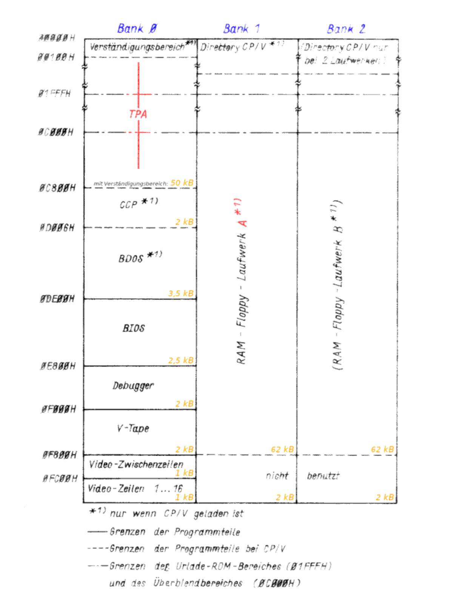

.. index:: pair: PC/M; Zentrale Platine

.. _kcsystems-mach-pcm-fa038805:
.. _kcsystems-mach-pcm-fa048804:

Die zentrale Platine
####################

Die zentrale Platine stellt das Herzstück des |PC/M| Computers dar und bestimmt durch ihre Konzeption den Umfang und die Erweiterungsmöglichkeiten des gesamten Systems (|PC_M_B01A_N| und |PC_M_B01B_N|).

Sie beinhaltet folgende Funktionsgruppen:

- Takterzeugung
- Resetlogik
- |NMI| Generator
- |CPU| und Bustreiber
- Bootstraploader
- Adressdekodierung für Speicher
- RFSH, /RAS, /CAS Steuerung
- 192 |kB| |DRAM| Block
- 8 |kB| |EPROM| Block
- Adressdekodierung für I/O Ports
- System |PIO|, System |CTC|
- Anwender |PIO|, Anwender |CTC|
- Anwender |SIO|, |V.24| bzw. |IFSS| Interface
- Kassetteninterface

.. index:: triple: PC/M; Stromlaufplan; FA 3/88-05 (BG)

.. list-table:: FA 3/88-05 (BG)
   :name: kcsystems-mach-pcm-fa038805-bg
   :class: longtable
   :align: center
   :width: 80 %
   :header-rows: 1

   * - FA 3/88-05 (BG)

   * - .. figure:: bild-01a.png
          :name: kcsystems-mach-pcm-bild-01a
          :figclass: align-center
          :align: center
          :width: 850 px
          :alt: Übersichtsplan des Computers - Systemseite

          Übersichtsplan des Computers - Systemseite

   * - .. figure:: bild-01b.png
          :name: kcsystems-mach-pcm-bild-01b
          :figclass: align-center
          :align: center
          :width: 850 px
          :alt: Übersichtsplan des Computers - Input/Output Seite

          Übersichtsplan des Computers - Input/Output Seite

Das Rechnerkonzept, basierend auf dem 8 bit Prozessor |U880|, ist softwareseitig kompatibel zu Systemen wie dem Bürocomputer |A5120|, |A5130|, |PC1715| usw. mit dem Betriebssystem |SCP|. Es wurden 124 |kB| |DRAM| als |RAM| Floppy organisiert, um die diskettenorientierte Arbeitsweise des Betriebssystems zu gewährleisten. Als dauerhafter Speicher wird, wie auch im Grundbetriebssystem, die Kassette eingesetzt, worauf die "|RAM| Disketten" oder einzelne Dateien von diesen dauerhaft abgelegt werden können.

.. index:: pair: PC/M; Systemseite

Systemseite
***********

.. index:: triple: PC/M; Stromlaufplan; FA 3/88-05 (SP/1)

.. list-table:: FA 3/88-05 (SP/1)
   :name: kcsystems-mach-pcm-fa038805-sp1
   :class: longtable
   :align: center
   :width: 80 %
   :header-rows: 1

   * - FA 3/88-05 (SP/1)

   * - :raw-latex:`\begin{turn}{90}`
       :raw-latex:`\begin{minipage}[c][][c]{0.85\textheight}`

       .. figure:: bild-02.png
          :name: kcsystems-mach-pcm-bild-02
          :figclass: align-center
          :align: center
          :width: 850 px
          :alt: Stromlaufplan der Zentralen Platine - Systemseite

          Stromlaufplan der Zentralen Platine - Systemseite

       :raw-latex:`\end{minipage}`
       :raw-latex:`\end{turn}`

.. index:: triple: PC/M; Systemseite; Taktversorgung
.. index:: triple: PC/M; Systemseite; Resetlogik
.. index:: triple: PC/M; Systemseite; NMI Generator

Taktversorgung, Resetlogik, NMI Generator
=========================================

Als Taktgenerator wird ein quarzstabilisierter TTL Generator verwendet (D1). Dieser schwingt mit einer Frequenz von 10 |MHz| und liefert der zentralen Platine, nach einer 1:4 Teilung (D2) und anschließendem passiven pull up (geforderter High Pegel an den Takteingängen der Systembausteine), den Systemtakt von 2,5 |MHz|.

Um den Rechner hardwaremäßig in einen definierten Grundzustand bringen zu können, wurde die Resetlogik (D3) realisiert. Diese bewirkt über ein RC Glied, dessen Kondensator sich beim Einschalten auflädt (D3 wirkt dabei als Trigger), das Einschaltreset (power on). Im eingeschalteten Zustand kann der Computer über die Resettaste in den Ausgangszustand versetzt werden. Ein weiteres RC Glied verhindert dabei den Datenverlust der dynamischen |RAM| durch zu langes Betätigen der Resettaste.

Durch die UND Verknüpfung des Resetsignals mit /M1 (D3) wird das für die |PIO| Schaltkreise benötigte /M1 Signal generiert, welches im Zustand /RD = High und /IORQ = High zum Rücksetzen der |PIO| |U855| benötigt wird.

Über den |NMI| Generator wird der Schrittbetrieb des Prozessors ermöglicht, wodurch erstellte Programme getestet werden können (s. Debugger). Weiterhin ist eine |NMI| Taste parallel zum |NMI| Generator zum Erreichen des nichtmaskierten Interrupts eingebunden.

Die Signale /INT, /WAIT und /BUSRQ sind, da Low aktiv, über 3,9 |kO| Widerstände auf ein sicheres High Potential gebracht worden. Diese sind neben den Signalen /RESET, /NMI und dem Systemtakt CP auf den Systembus X3 geführt. Über LED6 wird der HALT Zustand der |CPU| angezeigt :cite:`pcm:kieser1986mikroprozessortechnik`, :cite:`pcm:huebler1985ausbaufaehiger`.

.. index:: triple: PC/M; Systemseite; Bustreiber

Bustreiber
==========

Die |CPU| Ausgänge können nur eine TTL Last treiben. Die Adress- und Steuerausgänge der |CPU| werden zum Zweck der Vergrößerung der Busbelastbarkeit über Bustreiber (D6 bis D8) getrieben. Damit wird auch eine Unterdrückung des Einflusses von Störimpulsen und Leitungskapazitäten erreicht. Außerdem nehmen die Ausgänge der Bustreiber beim Aktivieren des /BUSAK Signals (an /BUSRQ liegt eine |DMA| Anforderung an) den hochohmigen Zustand ein. Der bidirektionale Datenbus liegt wegen der geringen Belastung ungepuffert vor.

Das mit /Reset verknüpfte /M1 Signal steht ebenfalls getrieben zur Verfügung (Bedingung für |PIO|'s) :cite:`pcm:kieser1986mikroprozessortechnik`.

.. index:: triple: PC/M; Systemseite; Bootstraploader
.. index:: triple: PC/M; Systemseite; Urlader

Bootstraploader (Urlader)
=========================

Der Bootstraploader hat die Aufgabe bei einem hardwaremäßigen Reset (z.B. Power On, Reset) das Grundbetriebssystem für die Anfangsinitialisierung bereitzustellen. Dieses befindet sich auf dem 8 |kB| |EPROM| Block. Nach der Anfangsinitialisierung wird das Betriebssystem über eine Laderoutine in den |RAM| geladen und der |EPROM| Bereich ausgeblendet.

Kern des Bootstraploader ist der Schaltkreis DS 8212 (D9). Dieser besteht aus einem 8 Bit Datenregister und den dazugehörigen Treibern mit Tristate Ausgangsstufen. Über den /CLR Eingang lassen sich alle Ausgänge zurücksetzen. Dieser Umstand wird genutzt, um nach Reset den |EPROM| Block einzublenden. Darüber hinaus wird über diesen Schaltkreis die Auswahl der 64 |kB| |DRAM| Blöcke realisiert. Wird nicht im Block 0 gearbeitet, kann dessen oberer 16 |kB| Bereich (0C000H - 0FFFFH) in den gerade aktuellen Block eingeblendet werden. Dazu wird durch einen OUT Befehl Bit6 auf Adresse 94H gesetzt. Will man den |EPROM| Block anstelle des |DRAM| Bereiches 0000H bis 1FFFH eingeblendet haben, muss Bit7 rückgesetzt werden. (|PC_M_B05_N|)

   Aufteilung des 192 |kB| Speicherraumes

.. index:: triple: PC/M; Systemseite; Adressdekodierung für die Speicher

Adressdekodierung für die Speicher
==================================

Über das Register D9 und den Dekoder D10 können die drei internen 64 |kB| |DRAM| Blöcke und weitere fünf externe 64 |kB| Blöcke (bei eventueller |RAM| Erweiterung) über Port 94H ausgewählt werden. Bei |RAM| Erweiterungen müssen die /RAS, /CAS Signale extern erzeugt werden (Verknüpfung mit /RFSH beachten !). Im Grundzustand (nach Reset, Power On) ist automatisch der |DRAM| Block 0 im Zugriff.

Die Adressdekodierung für die vier |EPROM| Schaltkreise U 2716 (D14 bis D17) ab Adresse 0000H bis 1FFFH übernimmt der Dekoder D11, indem er aus den Adressen A11 und A12 vier, je 2 |kB| versetzte, /OE Signale bildet. Die /CE Eingänge der |EPROM| Schaltkreise sind parallel geschaltet und nur dann aktiv (/CE = Low), wenn sich der |EPROM| Block im Zugriff befindet. Der Adressdekoder wird nur bei /RD = LOW aktiviert :cite:`pcm:kieser1986mikroprozessortechnik`.

.. index:: triple: PC/M; Systemseite; /RAS, /CAS Signalgenerierung

/RAS, /CAS Signalgenerierung
============================

Die Signale /RAS, /WR sowie die Freigabe der /CAS Signale werden über das D-Flip-Flop D50 und die Gatter D46.2, D47.2, D47.3, D51.3 und D53 in zeitlicher Reihenfolge und Zuordnung (|PC_M_B28_N| und |PC_M_B29_N|) generiert. Dabei ist die /RAS, /CAS Logik nur aktiv beim Zugriff auf einen der drei internen 64 |kB| Blöcke. /RAS wird weiterhin zur Übernahme der Refreshadresse bei Aktivieren von /RFSH erzeugt. Für eine externe Speichererweiterung bedeutet dieser Umstand, dass auf der Erweiterungsplatine die /RAS, /CAS Signalerzeugung für diese realisiert werden muss. Sie kann analog der internen Logik aufgebaut sein. Die /CAS Freigabe wird verzögert und negiert zur Busanschaltung der Bustreiber benutzt.

Die vom Dekoder D10 kommenden Blockauswahlsignale werden über die Gatter D47 und D48 mit der /CAS Freigabe zu den Signalen /CAS0, /CAS1 und /CAS2 verknüpft und über D49 zusätzlich verzögert. Diese liegen auf den /CAS Eingängen der einzelnen 64 |kB| Blöcke. Die /RAS und /WR Eingänge der |DRAM| IC's sowie die /CAS Eingänge je 64 |kB| Block sind parallel geschaltet :cite:`pcm:kieser1986mikroprozessortechnik`, :cite:`pcm:buerger1985sramunddram`.

.. index:: triple: PC/M; Systemseite; 192 KByte DRAM Block

192 KByte DRAM Block
====================

Der |RAM| Speicher des Computers besteht aus 3 |x| 8 Stück 64 |kb| |DRAM| Schaltkreisen U 2164 (D20 bis D43). Die notwendige 16 Bit Adresse wird über die Multiplexer D44 und D45 an die Adresseingänge A0 bis A7 gelegt. Mit /RAS liegen die Adressen A0 bis A7 (Zeilenadresse), mit /CAS die Adressen A8 bis A15 (Spaltenadresse) an den Eingängen der Speicher an. Das SEL Signal (/CAS Freigabe) wird in der /RAS, /CAS Logik gebildet. Die Datenein- und Datenausgänge werden über die Bustreiber D18 und D19 gepuffert und bei Zugriffen auf einen der drei Blöcke an den Bus geschaltet. Mit /RD werden bei Lesezugriffen die Ausgänge der Speicher über die Bustreiber an den Datenbus gekoppelt. Ist das /CAS Freigabesignal inaktiv (Low), befinden sich die Ausgänge der Bustreiber im hochohmigen Zustand. Die Adress- und Datenleitungen der Blöcke sind parallel geschaltet, da die Blockauswahl über die /CAS Eingänge der Speicher realisiert wird.

.. index:: triple: PC/M; Systemseite; 8 KByte EPROM Block

8 KByte EPROM Block
===================

Hardwaremäßig wurde der |EPROM| Block mit 4 IC's U 2716 (D14 bis D17) realisiert. Die /CE Eingänge sind parallel geschaltet und werden beim Zugriff durch die |CPU| aktiviert. Die /OE Eingänge werden durch die Dekodierung der Adressen A11 und A12 (D11) erzeugt.

.. index:: pair: PC/M; Input/Output Seite

Input/Output Seite
******************

.. index:: triple: PC/M; Stromlaufplan; FA 3/88-05 (SP/2)

.. list-table:: FA 3/88-05 (SP/2)
   :name: kcsystems-mach-pcm-fa038805-sp2
   :class: longtable
   :align: center
   :width: 80 %
   :header-rows: 1

   * - FA 3/88-05 (SP/2)

   * - :raw-latex:`\begin{turn}{90}`
       :raw-latex:`\begin{minipage}[c][][c]{0.85\textheight}`

       .. figure:: bild-03.png
          :name: kcsystems-mach-pcm-bild-03
          :figclass: align-center
          :align: center
          :width: 850 px
          :alt: Stromlaufplan der Zentralen Platine - Input/Output Seite

          Stromlaufplan der Zentralen Platine - Input/Output Seite

       :raw-latex:`\end{minipage}`
       :raw-latex:`\end{turn}`

.. index:: triple: PC/M; Input/Output Seite; Adressdekodierung für die I/O Ports

Adressdekodierung für die I/O Ports
===================================

Die Auswahlsignale für die Peripheriebausteine sind in Schritten zu je vier Adressen dekodiert. Diese vier Kanäle der Systembausteine (|SIO|, |CTC|, |PIO|) werden über die Adressen A0 und A1 ausgewählt. Durch den Dekoder D54 wird der entsprechende Baustein ausgewählt, wobei die niedrigste Adresse 80H (System |CTC|) beträgt. D54 erzeugt die /CE Signale aus den Adressen A2 bis A7. Die Adressleitungen A8 bis A15 werden nicht dekodiert. Der Dekoder wurde nicht mit dem Signal /IORQ verknüpft, da alle verwendeten Peripheriebausteine dieses Signal zu ihrer Aktivierung nutzen. Zum externen Anschluss eines weiteren Bausteines dient die auf den Systembus geführte Leitung /IOSEL0, die auf den /CE Eingang des externen Peripheriebausteines geschaltet wird. Eine Erweiterung auf 64 Bausteine ist durch die externe Dekodierung der Adressen A2 bis A7 (00H bis 7CH und 0A0H bis 0FCH) möglich. Als interne I/O Bausteinadressen zählen auch die des Speicherblockselektierungsport (D9) und die des |NMI| Generators (D60.2) :cite:`pcm:clasen1986wissensspeicher`.

.. index:: triple: PC/M; Zusatzdaten; FA 3/88-05 (ZD/1)
.. index:: triple: PC/M; Zusatzdaten; FA 3/88-05 (ZD/2)

.. list-table:: FA 3/88-05 (ZD/1) (ZD/2)
   :name: kcsystems-mach-pcm-fa038805-zd12
   :class: longtable
   :align: center
   :width: 80 %
   :header-rows: 1

   * - FA 3/88-05 (ZD/1)
     - FA 3/88-05 (ZD/2)

   * - :raw-latex:`\begin{minipage}[c][][c]{0.45\textwidth}`

       .. figure:: bild-30.png
          :name: kcsystems-mach-pcm-bild-30
          :figclass: align-center
          :align: center
          :width: 320 px
          :alt: Input/Output Adressen

          Input/Output Adressen

       :raw-latex:`\end{minipage}`

     - :raw-latex:`\begin{minipage}[c][][c]{0.45\textwidth}`

       .. figure:: bild-31.png
          :name: kcsystems-mach-pcm-bild-31
          :figclass: align-center
          :align: center
          :width: 320 px
          :alt: Belegung System PIO - Tastatur

          Belegung System PIO - Tastatur

       :raw-latex:`\end{minipage}`

.. index:: triple: PC/M; Input/Output Seite; System PIO
.. index:: triple: PC/M; Input/Output Seite; System CTC

System PIO, System CTC
======================

Bei Interrupt die höchste Priorität besitzend, befindet sich ab Adresse 80H der System |CTC| (D55). Der Eingang IEI bildet, auf den Systemsteckverbinder X3 geführt, die Einbindungsmöglichkeit weiterer Bausteine mit höherer Priorität in die "Daisy chain". Bei der Nutzung einer externen Erweiterung sollte für weitere Bausteine eine Umgehungslogik vorgesehen werden.

Ausgang TD0 der System |CTC| stellt den Takt für den Kanal A der Anwender |SIO| |U856| (D57) zur Verfügung. TD1 realisiert dies für den Kanal B der |SIO| (Einstellung der Baudrate). Ausgang TD2 hingegen steuert ein Flip Flop (D60.1), um die am Ausgang der |CTC| auftretenden Impulse in eine Impulsfolge mit einem Tastverhältnis von 1:1 zu formen.

Auf Adresse 84H folgt als zweiter Baustein die System |PIO| Über sechs LED, die sich auf der Tastatur befinden, werden bestimmte Zustände des Computers angezeigt (|PC_M_B31_N|). An den Anschlüssen A0 bis A7 (|PIO| Port A) wird die Tastatur mit den Leitungen TD0 bis TD6 und TAST angeschlossen. B0 bis B5 steuern LED0 bis LED5, B6 und B7 von Port B dienen dem Kassettenmagnetbandgerät als Aus- bzw. Eingang. Die gesamte Belegung der System |PIO| Ports ist aus |PC_M_B31_N| ersichtlich :cite:`pcm:clasen1986wissensspeicher`.

.. index:: triple: PC/M; Input/Output Seite; Anwender PIO
.. index:: triple: PC/M; Input/Output Seite; Anwender CTC

Anwender PIO, Anwender CTC
==========================

Die Kanaladressen 8CH bis 8FH belegt die Anwender |CTC| (D58) mit den Kanälen 0 bis 3, wobei nur die Kanäle 0, 1 und 2 Ein- und Ausgänge besitzen. Die Eingänge TD0, TD1, TD2 sowie die Ausgänge TRG0 bis TRG3 wurden auf den Koppelbus geführt und stehen dem Anwender frei zur Verfügung. Eine eventuelle Kaskadierung mehrerer Kanäle, z.B. bei Uhrenbetrieb, muss über den Koppelsteckverbinder X2 realisiert werden. Es existiert dazu kein separates Koppelfeld.

Den zweiten Anwenderbaustein stellt die |PIO| D59 (90H bis 93H) dar. Ausgang IEO (auf Systembus X3 geführt) dient der weiteren Einbindung von peripheren Bausteinen niedrigerer Priorität über deren IEI, IEO Anschluss in die "Daisy Chain" :cite:`pcm:clasen1986wissensspeicher`.

.. index:: triple: PC/M; Input/Output Seite; Anwender SIO
.. index:: triple: PC/M; Input/Output Seite; V.24
.. index:: triple: PC/M; Input/Output Seite; IFSS

Anwender SIO, V.24 bzw. IFSS Interface
======================================

Zur Realisierung serieller Schnittstellen (Anschluss Floppy Controller, Drucker und anderer seriell ansteuerbarer Baugruppen) befindet sich auf der zentralen Platine eine |SIO| |U856| (D57). Die beiden Taktsignale /RxCA und /RxCB werden, wie bereits beschrieben, durch den System |CTC| (D55) erzeugt. Um neben der |IFSS| Schnittstelle eine |V.24| Schnittstelle (auch |RS232C| möglich) realisieren zu können, werden die Signale /RTSA, /RTSB, /DTRA und /DTRB auf den Koppelbus geführt.

Als |IFSS| Schnittstelle wurden für die Kanäle A und B 20 |mA| Stromschleifen (Sender und Empfänger) realisiert. Über die Optokoppler A2 bis A5 erfolgt die galvanische Trennung zwischen Gerät und Übertragungsleitung. Sowohl Sender als auch Empfänger können aktiv, also mit Stromeinspeisung, oder passiv betrieben werden. Die Stromquellen werden durch Widerstände gebildet. Die Auswahl der Betriebsart (aktiv/ passiv) kann mittels Brücken im Koppelfeld auf der zentralen Platine erfolgen. Über diese Schnittstellen kann der Computer auch an ein lokales Netz (z.B. Ringnetz) angeschlossen werden. Die Leitungen TxDA1, TxDA2, RxDA1 und RxDA2 sind auf eine |IFSS| Anschluss geführt :cite:`pcm:kuehn1986handbuchttlcmos`.

.. index:: triple: PC/M; Input/Output Seite; Kassetteninterface

Kassetteninterface
==================

Für die Ansteuerung des |KMBG| wurde auf der zentralen Platine im LOAD Zweig ein Bandpass mit nachfolgendem Trigger mittels Doppel |OPV| |B082| (A1) aufgebaut, um das vom |KMBG| kommende Signal für die als Eingang programmierte Leitung B7 der System |PIO| (D56) aufzubereiten. Die beiden Dioden dienen dabei zur Spannungsbegrenzung. Im SAVE Zweig befindet sich ein passiver Spannungsteiler zur Anpassung an die Eingangsstufe des |KMBG|. Die Pegel im LOAD bzw. SAVE Zweig können mit den Einstellreglern R1 und R2 angepasst werden.

PCB Layouts
***********

.. index:: triple: PC/M; PCB Layouts; FA 4/88-04 (LS)
.. index:: triple: PC/M; PCB Layouts; FA 4/88-04 (BS)

.. list-table:: FA 4/88-04 (LS) (BS)
   :name: kcsystems-mach-pcm-fa048804-lbs
   :class: longtable
   :align: center
   :width: 80 %
   :header-rows: 1

   * - FA 4/88-04 (LS) (BS)

   * - .. figure:: bild-04c.png
          :name: kcsystems-mach-pcm-bild-04c
          :figclass: align-center
          :align: center
          :width: 420 px
          :alt: Busplatine Leiterseite und Bestückungsseite

          Busplatine Leiterseite und Bestückungsseite

.. index:: triple: PC/M; PCB Layouts; FA 3/88-05 (KP/TA) :comp:`X1`
.. index:: triple: PC/M; PCB Layouts; FA 3/88-05 (KP/KB) :comp:`X2`
.. index:: triple: PC/M; PCB Layouts; FA 3/88-05 (KP/SB) :comp:`X3`

.. list-table:: FA 3/88-05 (KP)
   :name: kcsystems-mach-pcm-fa038805-kp
   :class: longtable
   :align: center
   :width: 80 %
   :header-rows: 1

   * - FA 3/88-05 (KP/TA) :comp:`X1`
     - FA 3/88-05 (KP/KB) :comp:`X2`
     - FA 3/88-05 (KP/SB) :comp:`X3`

   * - :raw-latex:`\begin{minipage}[c][][c]{0.3\textwidth}`

       .. figure:: bild-32.png
          :name: kcsystems-mach-pcm-bild-32
          :figclass: align-center
          :align: center
          :width: 320 px
          :alt: Belegung Steckverbinder - Tastatur :comp:`X1`

          Belegung Steckverbinder - Tastatur :comp:`X1`

       :raw-latex:`\end{minipage}`

     - :raw-latex:`\begin{minipage}[c][][c]{0.3\textwidth}`

       .. figure:: bild-33.png
          :name: kcsystems-mach-pcm-bild-33
          :figclass: align-center
          :align: center
          :width: 320 px
          :alt: Belegung Steckverbinder - Koppelbusverbinders :comp:`X2`

          Belegung Steckverbinder - Koppelbusverbinders :comp:`X2`

       :raw-latex:`\end{minipage}`

     - :raw-latex:`\begin{minipage}[c][][c]{0.3\textwidth}`

       .. figure:: bild-34.png
          :name: kcsystems-mach-pcm-bild-34
          :figclass: align-center
          :align: center
          :width: 320 px
          :alt: Belegung Steckverbinder - Systembusverbinders :comp:`X3`

          Belegung Steckverbinder - Systembusverbinders :comp:`X3`

       :raw-latex:`\end{minipage}`

.. index:: triple: PC/M; PCB Layouts; FA 3/88-05 (BP)

.. list-table:: FA 3/88-05 (BP)
   :name: kcsystems-mach-pcm-fa038805-bp
   :class: longtable
   :align: center
   :width: 80 %
   :header-rows: 1

   * - FA 3/88-05 (BP)

   * - :raw-latex:`\begin{turn}{90}`
       :raw-latex:`\begin{minipage}[c][][c]{0.9\textheight}`

       .. figure:: bild-04d.png
          :name: kcsystems-mach-pcm-bild-04d
          :figclass: align-center
          :align: center
          :width: 850 px
          :alt: Bestückungsplan der Zentrale Platine

          Bestückungsplan der Zentrale Platine

       :raw-latex:`\end{minipage}`
       :raw-latex:`\end{turn}`

.. index:: triple: PC/M; PCB Layouts; FA 3/88-05 (LS)

.. list-table:: FA 3/88-05 (LS)
   :name: kcsystems-mach-pcm-fa038805-ls
   :class: longtable
   :align: center
   :width: 80 %
   :header-rows: 1

   * - FA 3/88-05 (LS)

   * - :raw-latex:`\begin{turn}{90}`
       :raw-latex:`\begin{minipage}[c][][c]{0.9\textheight}`

       .. figure:: bild-04b.png
          :name: kcsystems-mach-pcm-bild-04b
          :figclass: align-center
          :align: center
          :width: 850 px
          :alt: Leiterzüge Leiterseite Zentrale Platine

          Leiterzüge Leiterseite Zentrale Platine

       :raw-latex:`\end{minipage}`
       :raw-latex:`\end{turn}`

.. index:: triple: PC/M; PCB Layouts; FA 3/88-05 (BS)

.. list-table:: FA 3/88-05 (BS)
   :name: kcsystems-mach-pcm-fa038805-bs
   :class: longtable
   :align: center
   :width: 80 %
   :header-rows: 1

   * - FA 3/88-05 (BS)

   * - :raw-latex:`\begin{turn}{90}`
       :raw-latex:`\begin{minipage}[c][][c]{0.9\textheight}`

       .. figure:: bild-04a.png
          :name: kcsystems-mach-pcm-bild-04a
          :figclass: align-center
          :align: center
          :width: 850 px
          :alt: Leiterzüge Bestückungsseite Zentrale Platine

          Leiterzüge Bestückungsseite Zentrale Platine

       :raw-latex:`\end{minipage}`
       :raw-latex:`\end{turn}`

.. index:: triple: PC/M; Software; FA 3/88-05 (SW/BIOS2X62) :comp:`D14`

.. list-table:: FA 3/88-05 (SW/BIOS2X62)
   :name: kcsystems-mach-pcm-fa038805-sw1
   :class: longtable
   :align: center
   :width: 80 %
   :header-rows: 1

   * - FA 3/88-05 (SW/BIOS2X62) :comp:`D14`

   * - .. figure:: bild-36a.png
          :name: kcsystems-mach-pcm-bild-36a
          :figclass: align-center
          :align: center
          :width: 850 px
          :alt: |BIOS| Listing Teil 1 und 2 (2 |x| 62 |kB| |RAM| Floppy)

          |BIOS| Listing (2 |x| 62 |kB| |RAM| Floppy)

.. index:: triple: PC/M; Software; FA 3/88-05 (SW/BIOS1X124) :comp:`D14`

.. list-table:: FA 3/88-05 (SW/BIOS1X124)
   :name: kcsystems-mach-pcm-fa038805-sw2
   :class: longtable
   :align: center
   :width: 80 %
   :header-rows: 1

   * - FA 3/88-05 (SW/BIOS1X124) :comp:`D14`

   * - .. figure:: bild-36b.png
          :name: kcsystems-mach-pcm-bild-36b
          :figclass: align-center
          :align: center
          :width: 850 px
          :alt: |BIOS| Listing Teil 1 und 2 (1 |x| 124 |kB| |RAM| Floppy)

          |BIOS| Listing (1 |x| 124 |kB| |RAM| Floppy)

.. index:: triple: PC/M; Software; FA 3/88-05 (SW/DBG) :comp:`D15`

.. list-table:: FA 3/88-05 (SW/DBG)
   :name: kcsystems-mach-pcm-fa038805-sw3
   :class: longtable
   :align: center
   :width: 80 %
   :header-rows: 1

   * - FA 3/88-05 (SW/DBG) :comp:`D15`

   * - .. figure:: bild-40.png
          :name: kcsystems-mach-pcm-bild-40
          :figclass: align-center
          :align: center
          :width: 850 px
          :alt: Listing |Debugger| Teil 1 und 2

          Listing |Debugger| Teil 1 und 2

.. index:: triple: PC/M; Software; FA 3/88-05 (SW/VTP) :comp:`D16`

.. list-table:: FA 3/88-05 (SW/VTP)
   :name: kcsystems-mach-pcm-fa038805-sw4
   :class: longtable
   :align: center
   :width: 80 %
   :header-rows: 1

   * - FA 3/88-05 (SW/VTP) :comp:`D16`

   * - .. figure:: bild-39.png
          :name: kcsystems-mach-pcm-bild-39
          :figclass: align-center
          :align: center
          :width: 850 px
          :alt: Listing Kommandoprozessor und |V-Tape| Teil 1 und 2

          Listing Kommandoprozessor und |V-Tape| Teil 1 und 2

.. index:: triple: PC/M; Software; FA 3/88-05 (SW/CCP) :comp:`D17`

.. list-table:: FA 3/88-05 (SW/CCP)
   :name: kcsystems-mach-pcm-fa038805-sw5
   :class: longtable
   :align: center
   :width: 80 %
   :header-rows: 1

   * - FA 3/88-05 (SW/CCP) :comp:`D17`

   * - .. figure:: bild-38a.png
          :name: kcsystems-mach-pcm-bild-38a
          :figclass: align-center
          :align: center
          :width: 850 px
          :alt: Listing |CCP| Teil 1 und 2

          Listing |CCP| Teil 1 und 2

.. index:: triple: PC/M; Software; FA 3/88-05 (SW/BDOS) :comp:`D20` |...| :comp:`D27`

.. list-table:: FA 3/88-05 (SW/BDOS)
   :name: kcsystems-mach-pcm-fa038805-sw6
   :class: longtable
   :align: center
   :width: 80 %
   :header-rows: 1

   * - FA 3/88-05 (SW/BDOS) :comp:`D20` |...| :comp:`D27`

   * - .. figure:: bild-38b.png
          :name: kcsystems-mach-pcm-bild-38b
          :figclass: align-center
          :align: center
          :width: 850 px
          :alt: Listing |BDOS| Teil 1 und 2

          Listing |BDOS| Teil 1 und 2

   * - .. figure:: bild-38c.png
          :name: kcsystems-mach-pcm-bild-38c
          :figclass: align-center
          :align: center
          :width: 850 px
          :alt: Listing |BDOS| Teil 3 und 4

          Listing |BDOS| Teil 3 und 4

.. spelling::

   Adress
   Datenein
   RxCA
   RxCB

.. Local variables:
   coding: utf-8
   mode: text
   mode: rst
   End:
   vim: fileencoding=utf-8 filetype=rst :
