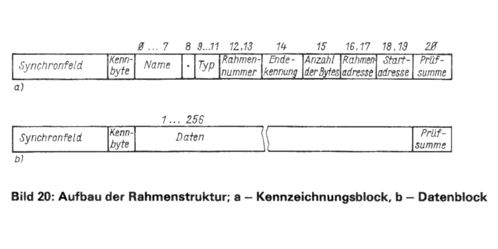
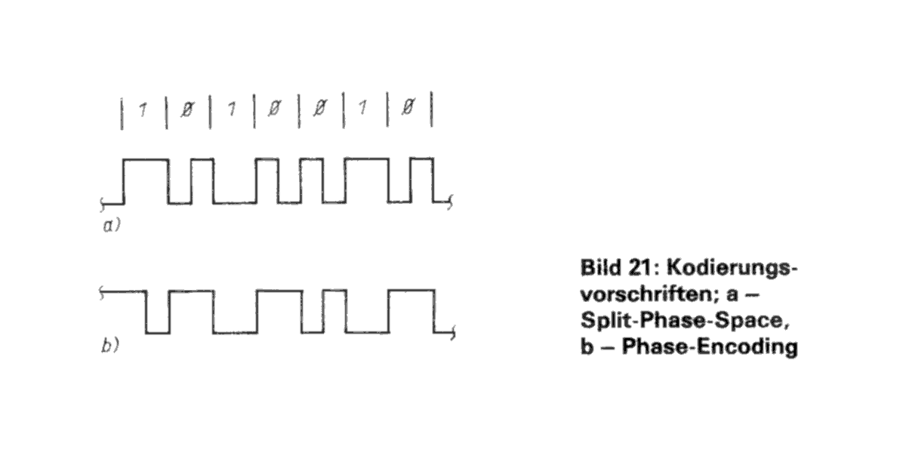
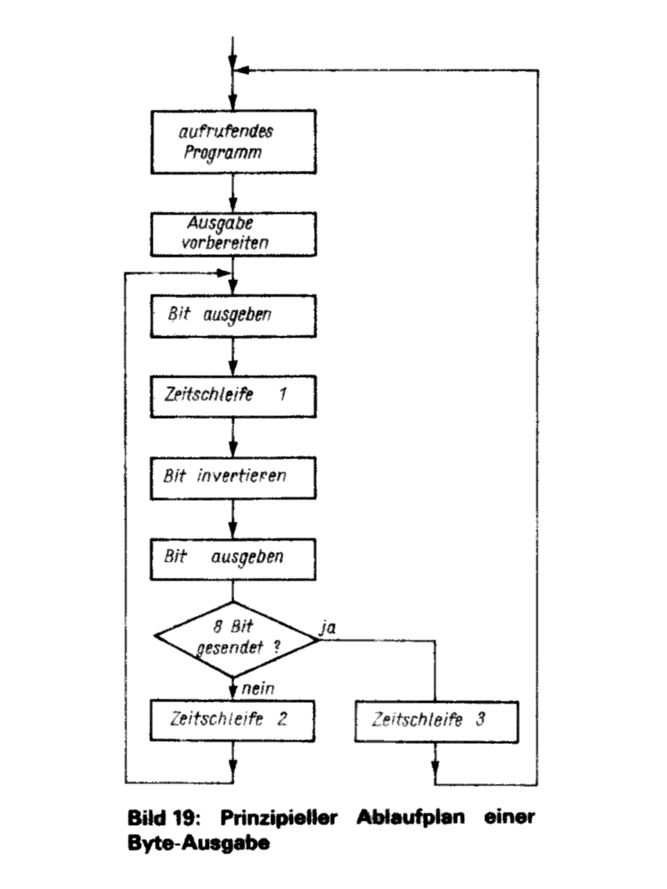
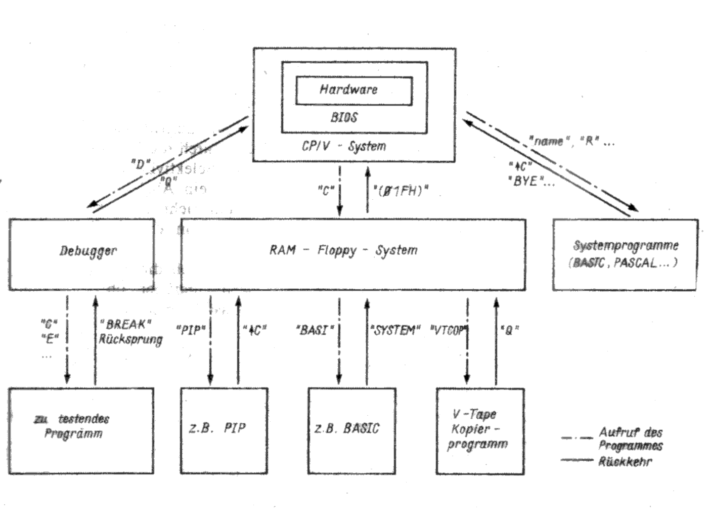

.. highlight:: none
   :linenothreshold: 1

.. index:: pair: PC/M; Betriebssystem

Das Betriebssystem
##################

.. index:: triple: PC/M; Betriebssystem; Struktur

Die Struktur
************

Das Betriebssystem des |PC/M| Computers wurde in Form einzelner Blöcke erstellt. Diese Blöcke (Module) arbeiten weitgehend unabhängig voneinander. Sie sind damit sowohl leicht austauschbar als auch an andere Hardware anpassbar. Die erforderlichen Informationen sind in den nachfolgenden Abschnitten enthalten. Die Ein- und Austrittspunkte der Module sind in Listen (Sprungvektoren) auf den ersten Adressen des jeweiligen Modules zusammengefasst. Eine Erweiterung ist möglich, wenn weitere Sprungvektoren angefügt werden. Die Reihenfolge der Sprünge und deren Bedeutung sollte aber unter allen Umständen erhalten bleiben, um die Kompatibilität zu anderen Computern des gleichen Typs zu erhalten.

Die Bestandteile des |PC/M| Grundbetriebssystems sind:

- das |BIOS| (Basic Input Output System)
- der |Debugger| (Eingeben, Ändern und Testen von Programmen und Dateien)
- das Kassettenmodul |V-Tape| (logischer Kern des Grundbetriebssystems und Kassettenarbeit)

Werden die Programmteile

- |CCP| (Console Command Processor) und
- |BDOS| (Basic Disc Operating System)

nachgeladen, erhält man ein |CP/M| kompatibles Betriebssystem, mit dem eine Vielzahl von Programmen abgearbeitet werden kann.

.. index:: triple: PC/M; Betriebssystem; Softwarekern

Der Softwarekern
****************

Kern des gesamten Betriebssystems ist eine Sammlung von Programmen, die die Hardware des Rechners unmittelbar steuern (physische Treiber). Diese Routinen tragen den Charakter von Standardschnittstellen, die dem |CP/M| bzw. |SCP| |BIOS| entsprechen :cite:`pcm:autorenkollektiv1984systemhandbuchscp`. Viele Programme von Heimcomputern oder anderen Systemen verwenden diese oder sehr ähnliche Schnittstellen, wodurch sich der Aufwand bei der Programmanpassung sehr stark reduzieren lässt. Voraussetzung ist natürlich eine ähnliche Hardware und der gleiche Mikroprozessortyp :cite:`pcm:autorenkollektiv1985systemhandbuchscp`.

Das |BIOS| beginnt auf der Adresse :addr:`0DE00H` des Computers. In lückenloser Folge stehen ab dieser Adresse Sprünge, die zu den einzelnen Programmteilen des |BIOS| verzweigen.

Das |BIOS| ist in zwei Versionen vorgestellt, je nach Ausbaustufe des |RAM| Bereiches. Wird nur eine |RAM| Bank verwendet (64 |kB|), so sind verschiedene Routinen im |BIOS| nicht verwendbar und das System kann nicht als |CP/M| kompatibler Rechner eingesetzt werden. Trotzdem ist ein Fülle von Programmen nutzbar. Wird der Rechner mit insgesamt 128 |kB| |RAM| ausgerüstet, kann bereits mit einem |RAM| Floppy von 62 |kB| gearbeitet werden. Dazu existiert ein |BIOS|, welches zwei |RAM| Floppy zu je 62 |kB| verwalten kann (|PC_M_B05_N|). Bei 192 |kB| |RAM| sollte dann ein |BIOS| mit einem |RAM| Floppy zu 124 |kB| |RAM| eingesetzt werden, da viele Programme einen hohen Speicherbedarf haben und nicht auf mehrere Floppy's (|RAM| Bereiche) verteilt werden dürfen (z.B. WordStar). Das |BIOS| Listing ist in |PC_M_B36A_N| und |PC_M_B36B_N| dargestellt.

Die |BIOS| Routinen sind im einzelnen:

.. rubric:: :z80:`BOOT` (Kaltstart; :addr:`0DE00H`)

Der Start des Betriebssystems erfolgt nach :signal:`RESET` oder nach dem Einschalten. Die Hardware wird für den Betrieb vorbereitet und es werden verschiedene Grundeinstellungen vorgenommen. Das Betriebssystem wird vom |ROM| in den |RAM| geladen und der |ROM| Bereich wird danach abgeschaltet. Dadurch ist der gesamte Arbeitsspeicher des Mikroprozessor als |RAM| verfügbar und kann beliebig beschrieben werden, was wiederum die Anpassung fremder Software erleichtert. Der Bildschirm wird gelöscht, und es erfolgt eine Kaltstartausschrift mit Anzeige der Systemversion. Die Systemports (Kassettengerät und |SIO| Schnittstelle) werden initialisiert. Die Steuerwörter für die Initialisierung sind in einer Tabelle zusammengefasst und können erweitert bzw. ergänzt werden (Adresse :addr:`0E3B2H` - :addr:`0E3F1H`, bei 124 |kB| |RAM| Floppy). In dieser Tabelle ist zuerst das Port eingetragen, auf welches das nachfolgende Steuerwort ausgegeben werden soll. Schließlich erfolgt ein Sprung in das Kassettenmodul |V-Tape|, welches zusätzlich die Steuerung des Systems übernimmt.

.. rubric:: :z80:`WBOOT` (Warmstart; :addr:`0DE03H`)

Die Routine versucht in das |RAM| Floppy Betriebssystem (Bestandteil des |CP/V| Systems) einzusteigen bzw. wieder dorthin zurückzukehren. Gleichzeitig werden der |Debugger| und das |V-Tape| Modul vom |ROM| nachgeladen. Nun wird geprüft, ob |CCP| und |BDOS| bereits geladen wurden. Ist das der Fall, erscheint die Angabe des aktuellen Laufwerkes, und die Arbeit im |CP/M| kompatiblen |CP/V| System kann beginnen. Verschiedene |CP/M| Programme zerstören während ihrer Arbeit den |CCP|. Um ein häufiges Nachladen zu vermeiden, wurde der |CCP| im |ROM| abgelegt. Das |BDOS| muss grundsätzlich von Kassette nachgeladen werden, es wird aber im Normalfall während der Programmarbeit nicht zerstört. Wurde ein Fehler im |BDOS| bzw. |CCP| festgestellt, erscheint die Ausschrift :console:`CCP/BDOS Laden!` (|CCP| |ROM| nicht gesteckt oder defekt) oder :console:`BDOS Laden!` (|CCP| |ROM| OK). Dann muss das entsprechende Modul von Kassette nachgeladen werden.

Die |ROM| Belegung ist:

:IS :comp:`D14`: |BIOS|
:IS :comp:`D15`: |Debugger|
:IS :comp:`D16`: |V-Tape|
:IS :comp:`D17`: |CCP|

Der Rechner ist bereits mit einer Bestückung von :comp:`D14` und :comp:`D15` arbeitsfähig.

.. rubric:: :z80:`CSTS` (Consol STatuS, Tastaturstatus; :addr:`0DE06H`)

Die Routine kehrt mit einer Information über den Tastaturstatus in das aufrufende Programm zurück. Wurde eine Taste gedrückt, enthält das Register :reg:`A` der |CPU| den Wert :code:`0FFH`, wurde keine Taste gedrückt, den Wert :code:`00H`.

.. rubric:: :z80:`CI` (Consol Input, Tastaturabfrage; :addr:`0DE09H`)

Diese Routine kehrt mit dem Code der gedrückten Taste im Register :reg:`A` der |CPU| zurück.

Wird der Tastencode :code:`01EH` erzeugt, kann damit der Tastenklick (kurzer Signalton) ein- bzw. ausgeschaltet werden. Ist der Signalton ausgeschaltet, wird dieses durch LED 2 angezeigt. Der Code :code:`013H` wird für die Run/Stop (Lauf/Halt) Funktion verwendet und durch LED 1 angezeigt.

Der Tastencode :code:`01FH` kann zur Rückkehr aus dem |RAM| Floppy System in das |CP/V| Grundbetriebssystem genutzt werden.

.. rubric:: :z80:`CO` (Consol Output, Zeichenausgabe; :addr:`0DE0CH`)

Ein im Register :reg:`C` der |CPU| abgelegtes |ASCII| Zeichen wird auf der Konsole ausgegeben. Der Bildschirm wird zeilenweise, links oben beginnend beschrieben. Wurde die Cursordarstellung zugelassen, erscheint die nächste zu beschreibende Bildschirmposition mit der inversen Zeichendarstellung (Bildpunkte hell statt dunkel und umgekehrt). Einige Zeichen haben eine besondere Bedeutung und werden zur Ausführung bestimmter Funktionen auf der Konsole genutzt:

.. .. tabularcolumns:: ccL
.. tabularcolumns:: p{0.08\linewidth}p{0.12\linewidth}p{0.6\linewidth}
.. table:: |PC/M| |BIOS| :code:`CO` - Bedeutung von Sonderzeichen in Register :reg:`C`
   :widths: 10, 15, 75
   :class: longtable
   :align: center
   :width: 80%

   +-------------+---------------+--------------------------------------------------+
   | Code        | Kurzform      | Wirkung                                          |
   +=============+===============+==================================================+
   | :code:`01H` | :code:`HC`    | **Home Curs**; Cursor wird auf die linke obere   |
   |             |               | Ecke des Bildschirmes positioniert.              |
   +-------------+---------------+--------------------------------------------------+
   | :code:`07H` | :code:`BELL`  | **Bell**; Ausgabe eines Signaltons.              |
   +-------------+---------------+--------------------------------------------------+
   | :code:`08H` | :code:`BS`    | **Backspace**; Cursor ein Zeichen zurück.        |
   +-------------+---------------+--------------------------------------------------+
   | :code:`09H` | :code:`TAB`   | **Tabulator**; Cursor auf nächste 8er            |
   |             |               | Tabulatorposition.                               |
   +-------------+---------------+--------------------------------------------------+
   | :code:`0AH` | :code:`LF`    | **Line Feed**; Cursor eine Zeile nach unten.     |
   +-------------+---------------+--------------------------------------------------+
   | :code:`0CH` | :code:`CLS`   | **Clear Screen**; Bildschirm löschen und Cursor  |
   |             |               | in die linke obere Bildschirmecke positionieren. |
   +-------------+---------------+--------------------------------------------------+
   | :code:`0DH` | :code:`CR`    | **Carriage Return**; Cursor auf Zeilenanfang     |
   |             |               | setzen.                                          |
   +-------------+---------------+--------------------------------------------------+
   | :code:`14H` | :code:`CTEOS` | **Clear To End Of Screen**; Bildschirm ab        |
   |             |               | Position des Cursor bis zum Ende des             |
   |             |               | Bildschirmes löschen.                            |
   +-------------+---------------+--------------------------------------------------+
   | :code:`15H` | :code:`SKIP`  | **Skip**; Cursor ein Zeichen weiter.             |
   +-------------+---------------+--------------------------------------------------+
   | :code:`16H` | :code:`CTEOL` | **Clear To End Of Line**; wie :code:`CTEOS`,     |
   |             |               | aber bis zum Ende der Zeile.                     |
   +-------------+---------------+--------------------------------------------------+
   | :code:`18H` | :code:`CLI`   | **Clear Line**; Zeile löschen und Cursor an      |
   |             |               | Zeilenanfang positionieren.                      |
   +-------------+---------------+--------------------------------------------------+
   | :code:`1AH` | :code:`LB`    | **Line Back**; Cursor eine Zeile nach oben.      |
   +-------------+---------------+--------------------------------------------------+
   | :code:`1BH` | :code:`ESC`   | **Escape**; Einleiten der direkten               |
   |             |               | Cursorposition. Nachfolgendes Zeichen gibt       |
   |             |               | die Zeilenposition und drittes Zeichen die       |
   |             |               | Spaltenposition auf dem Bildschirm an, Bit 7 bei |
   |             |               | Spalten- und Zeilenangabe sind jeweils gesetzt   |
   |             |               | die Zählung beginnt mit 80H für die erste Spalte |
   |             |               | bzw. die erste Zeile.                            |
   |             |               |                                                  |
   |             |               | Beispiel: :code:`1BH 82H 8AH`                    |
   |             |               |                                                  |
   |             |               | Der Cursor wird auf die 11. Spalte (:code:`08AH`)|
   |             |               | der dritten Zeile (:code:`082H`) gesetzt.        |
   +-------------+---------------+--------------------------------------------------+
   | :code:`82H` | :code:`CON`   | **Cursor On**; Der Cursor wird eingeschaltet.    |
   +-------------+---------------+--------------------------------------------------+
   | :code:`83H` | :code:`COFF`  | **Cursor Off**; Der Cursor wird ausgeschaltet.   |
   +-------------+---------------+--------------------------------------------------+

.. rubric:: :z80:`LIST` (Druckerausgabe; :addr:`0DE0FH`)

Ein im Register :reg:`C` der |CPU| abgelegtes Zeichen wird auf den Drucker ausgegeben. Die Datenausgabe erfolgt auf |SIO| Kanal A mit 9600 |bps| bei 7 Bit Daten und gerader Parität (8. Bit). Die Informationen vom Drucker werden mit gleichen Bedingungen vom RxDA der |SIO| empfangen. Über einen entsprechenden |IFSS| Verbinder (s. Hardware) sind Drucker vom Typ |SD1152| oder |SD1157| mit |IFSS| Schnittstelle direkt anschließbar. Ein Umprogrammieren auf |V.24| oder |RS232C| ist ebenfalls möglich. Drucker mit paralleler Schnittstelle können über die Anwender |PIO| betrieben werden.

.. rubric:: :z80:`PUNCH` (Stanzerausgabe; :addr:`0DE12H`)

Zeichenausgabe an den Stanzer über Register :reg:`C` der |CPU| (ist im |CP/V| System nicht vorgesehen, aber nachrüstbar).

.. rubric:: :z80:`READER` (Lochbandleser; :addr:`0DE15H`)

Ein Zeichen wird vom Lochbandleser geholt und im Register :reg:`A` der |CPU| an das aufrufende Programm übergeben (ist im |CP/V| System nicht vorgesehen, aber nachrüstbar).

.. rubric:: :z80:`HOME` (Spur 0 justieren; :addr:`0DE18H`)

Die Spur 0 des ausgewählten Laufwerkes wird eingestellt.

.. rubric:: :z80:`SELDSK` (Laufwerk auswählen; :addr:`0DE1BH`)

Im Register :reg:`C` wird die Nummer des gewünschten Laufwerkes übergeben (0 = A, 1 = B bis 15 = P) und im Register :reg:`HL` die Adresse des zugehörigen Diskettenparameterkopfs zurückgegeben. Ist das Laufwerk nicht vorhanden, wird :code:`0000H` übergeben. Die Laufwerksauswahl erfolgt physisch erst bei :z80:`READ` oder :z80:`WRITE`.

.. rubric:: :z80:`SETTRK` (Spur auswählen; :addr:`0DE1EH`)

In :reg:`BC` wird die gewünschte Spurnummer übergeben. Die Spurauswahl erfolgt physisch wieder erst bei :z80:`READ` oder :z80:`WRITE`.

.. rubric:: :z80:`SETSEC` (Sektor auswählen; :addr:`0DE21H`)

In :reg:`BC` wird die gewünschte Sektornummer übergeben. Die Sektorauswahl erfolgt erst bei :z80:`READ` oder :z80:`WRITE`.

.. rubric:: :z80:`SETDMA` (|DMA| Puffer festlegen; :addr:`0DE24H`)

In :reg:`BC` wird die Adresse eines 128 Byte langen Puffers übergeben, in dem die Daten nach :z80:`READ` abgeholt werden können bzw. in dem die Daten vor :z80:`WRITE` eingetragen werden müssen.

.. rubric:: :z80:`READ` (Lesen eines Sektors; :addr:`0DE27H`)

Der vorher eingestellte Sektor (:z80:`SETSEC`) wird von der vereinbarten Spur (:z80:`SETTRK`) des gewünschten Laufwerkes (:z80:`SELDSK`) in den gewählten |DMA| Puffer (:z80:`SETDMA`) gelesen. Im Register :reg:`A` der |CPU| wird 0 übergeben (fehlerfreies Lesen, sonst würde 1 übergeben).

.. rubric:: :z80:`WRITE` (Schreiben eines Sektors; :addr:`0DE2AH`)

Ein wie bei :z80:`READ` ausgewählter Sektor wird durch den |DMA| Pufferinhalt beschrieben. Ist das nicht möglich, wird im Register :reg:`A` der |CPU| der Fehlercode 1 übergeben. Bei fehlerfreiem Schreiben wird 0 übergeben. Zusätzlich erscheint die Ausschrift :console:`BIOS RAM ERROR`, die auf nicht vorhandenen bzw. defekten |RAM| hinweist.

.. rubric:: :z80:`LISTST` (Druckerstatus; :addr:`0DE2DH`)

Ist der Drucker bereit ein Zeichen zu übernehmen, wird im Register :reg:`A` der |CPU| der Wert :code:`00H` übergeben, anderenfalls :code:`0FFH`.

.. rubric:: :z80:`SECTRAN` (Umwandeln der Sektornummer; :addr:`0DE30H`)

Im Registerpaar :reg:`BC` wird eine logische Sektornummer übergeben, die in eine physische Sektornummer umgewandelt und in :reg:`HL` zurückgegeben wird. Die Umrechnungstabelle wird durch die Adresse im Register :reg:`DE` angezeigt. Das |RAM| Floppy System unterscheidet nicht zwischen logischer und physischer Sektornummer.

.. index:: pair: PC/M; V-Tape
.. index:: triple: PC/M; Betriebssystem; Kassettenmodul
.. index:: triple: PC/M; Betriebssystem; V-Tape

Das Kassettenmodul V-Tape
*************************

Magnetbandspeicher besitzen eine nahezu unbegrenzte Speicherkapazität. Durch geringe Kosten und freie Verfügbarkeit der erforderlichen Geräte haben sich Kassettenmagnetbandgeräte (|KMBG|) in verschiedenen Einsatzgebieten von Mikrorechnern verbreitet. Für unterschiedliche Anwendungsfälle entstand so eine Vielzahl verschiedener Aufzeichnungsverfahren, die zum Teil stark differenzierte Merkmale aufweisen.

Das Kassettenmodul |V-Tape| übernimmt im |PC/M| Computer zwei Funktionen. Zum ersten kontrolliert und steuert es die Arbeit im Grundbetriebssystem des Rechners, und zum zweiten hat es die Aufgabe, Daten und Programme sicher und schnell auf Magnetband zu speichern und wieder lesen zu können. Hard- und Software für diese Aufgaben sind auf der zentralen Platine installiert.

.. index:: triple: PC/M; V-Tape; Magnetbandarbeit

Die Magnetbandarbeit
====================

.. rubric:: Das Aufzeichnungsverfahren

Die Aufzeichnung von Daten auf einem |KMBG| erfolgt durch Erzeugen eines seriellen Datenstromes bei möglichst geringem Hardwareaufwand. Dazu eignet sich besonders eine |PIO|, bei der ein Bit eines Kanales zur Ausgabe von Daten und ein weiteres Bit zur Eingabe von Daten verwendet wird. Durch serielles, kodiertes Ausgeben der Daten können diese aufgezeichnet werden. Der Lesevorgang erfolgt durch Abfrage der |PIO| und Dekodierung der gelesenen Informationen.

   Rahmenstruktur

   Kodierungsvorschriften

Im |Poly-Computer 880| wird nach der Kodierungsvorschrift Split-Phase-Space aufgezeichnet (|PC_M_B21_N|\ a). Die erforderliche Leistungsbandbreite zur Speicherung auf einem |KMBG| kann bei einer Geschwindigkeit von 1200 |bps| problemlos erreicht werden. Die Struktur der Datei :cite:`pcm:troll1982datenundprogrammspeicherung` weist alle für ein komfortables Verfahren erforderlichen Parameter auf. Die im |Poly880| implementierte Software nutzt die Möglichkeiten dieser Struktur nicht aus (Umfang ca. 400 Byte). Nachteilig ist, dass die Dateinamen nicht automatisch erkannt und zum Starten des Lesevorganges verwendet werden.

Das für den Datenaustausch zwischen Heimcomputern häufig verwendete Verfahren "SuperTape" :cite:`pcm:stiller1984supertapez80` arbeitet gleichfalls nach der Kodierungsvorschrift für Split-Phase-Space. Bemerkenswert ist, dass ein zeitlich optimiertes Programm verwendet wird. Die erforderliche Zeit zwischen den Abfragen bzw. Ausgaben beim Lesen und Schreiben wird durch die Anzahl der verbrauchten Takte der auszuführenden Befehle in Abhängigkeit von der Taktfrequenz der |CPU| des Rechners bestimmt. Das Verfahren erreicht damit Bitraten von 3600 |bps| oder wahlweise 7200 |bps|.

Allerdings konnte nicht mit jedem |KMBG| eine ausreichend niedrige Fehlerrate erreicht werden. Ungenügend ist die implementierte Fehlererkennung. Es wird lediglich die Anzahl aller übertragenen logischen Einsen verglichen. Die Angabe des Dateinamen und Dateityps entspricht üblichen Standards. Automatische Synchronisation und Fehlererkennung sind gewährleistet.

Das in :cite:`pcm:heyder8385ac1` beschriebene Verfahren für den |AC1| arbeitet nach der Kodierungsvorschrift für Phase-Encoding (Richtungstaktschrift, |PC_M_B21_N|\ b). Das zeitlich nicht optimierte Programm verwendet eine Bitrate von 1500 |bps|. Die Erkennung der Phasenlage erfolgt durch bitweise Abfrage der Synchronbytes der zu lesenden Datei (bei Verwendung verschiedener Geräte erforderlich). Blockstruktur, automatische Synchronisation und Namenserkennung sind nicht vorgesehen. Kritisch ist außerdem die Übertragung von Dateiparametern (Anfangsadresse, Startadresse, etc.) ohne Prüfung.

Anforderungen an ein Aufzeichnungsverfahren für |KMBG|

- automatische Synchronisation
- automatische Erkennung der gewünschten Daten
- Übertragung wichtiger Dateiparameter
- hohe Übertragungsgeschwindigkeit
- hohe Datensicherheit
- minimaler Hardwareaufwand
- leicht anpassbare Software

Das nachfolgend beschriebene Programm stellt einen Kompromiss des Forderungskataloges dar.

.. rubric:: Programmbeschreibung

Das Programm |V-Tape| arbeitet nach der Kodierungsvorschrift für Phase-Encoding :cite:`pcm:krass1984datenerfassung` bei einer typischen Bitrate von 3600 |bps| (Bitraten von 1200 |bps|, 2400 |bps| und 4800 |bps| sind auch möglich). Diese Bitrate setzt ein zeitlich optimiertes Programm voraus. Die Verwendung von |CTC| Interrupts für das Timing des Programmes ist nur eingeschränkt möglich, da es selbst bei ständiger Interruptfreigabe zu unterschiedlichen Zeiten bis zur Annahme der Interruptanforderung kommen kann. Für einen gerade auszuführenden OR A Befehl sind das, bei 2,5 |MHz| Taktfrequenz der |CPU|, 1,6 |us|, für den Befehl INC (IX+d) 9,2 |us|. Bezogen auf eine Halbperiode der Bittaktfrequenz ergibt sich ein Zeitfehler (bei 3600 |bps|) bis zu 5%. Existiert eine |NMI| Quelle, so vergrößert sich dieser Fehler programmabhängig. Weiterhin muss der |CTC| die höchste Priorität im System besitzen oder die einzige zugelassene Interruptquelle sein. Für |V-Tape| wurde der Weg der zeitlichen Optimierung des Programmes gewählt. Dabei beträgt der Zeitfehler beim Schreiben und beim Lesen der Informationen weniger als 1% der halben Periode der Bittaktfrequenz und wirkt sich praktisch nicht mehr auf die Datensicherheit bei der Übertragung aus. Die Anpassung des Programmes an verschiedene Taktfrequenzen und die Geschwindigkeitsänderung erfolgt durch Einfügen von Warteschleifen in die Unterprogramme zur Ausgabe eines Bit bzw. Byte und zum Lesen eines Bit bzw. Byte (|PC_M_B19_N|). Durch den Zeitverbrauch für Operationen zum Einlesen der Daten in den Speicher, zum Vergleichen, zur Prüfsummenbildung usw. ergibt sich eine erforderliche Mindesttaktfrquenz der |CPU| von 1,3 |MHz|. Die erforderliche Leistungsbandbreite beträgt nach :cite:`pcm:schmelovsky1979entzerrungfreies` für eine Bitrate von 3600 |bps| 720 |Hz| bis 5040 |Hz| und ist damit von jedem Heimmagnetbandgerät übertragbar, richtige Kopfposition vorausgesetzt. Die Erkennung der Phasenlage der zu lesenden Daten erfolgt programmseitig bei selbsttätiger Inversion der gelesen Datenbits.

   Prinzipieller Ablaufplan einer Byteausgabe

.. rubric:: Die Dateistruktur

Die Daten werden bei der Aufzeichnung in geblockter Form gesendet. Ein Rahmen besteht aus Kennzeichnungsblock und Datenblock. Vor einem Datenblock wird ein vollständiger Kennzeichnungsblock ausgegeben. Jedem Block werden Synchronzeichen vorangestellt. Danach folgen unterschiedliche Kennbytes, die Kennzeichnungsblock und Datenblock eindeutig voneinander unterscheiden. Somit wird gesichert, dass das Empfangsprogramm innerhalb einer Aufzeichnung synchronisiert und wichtige Parameter, wie der aktuelle Name, gelesen werden können. Das Auffinden einer Datei auf einer Kassette vereinfacht sich dadurch wesentlich. Weiterhin wird von einer dynamischen Rahmenlänge ausgegangen. Innerhalb eines Rahmens bleibt die Struktur dabei vollständig erhalten. Im Kennzeichnungsblock wird dazu eine Information über die Länge des nachfolgenden Datenblockes mitgeführt. Folglich können beliebige Dateilängen auf ein Byte genau gespeichert und wieder gelesen werden.
 
.. rubric:: Die Rahmenstruktur

Der Kennzeichnungsblock (|PC_M_B20_N|\ a) besteht aus Dateinamen und Dateityp. Es wurde die für das Betriebssystem |CP/M| übliche Struktur verwendet. Dabei besteht der Dateiname aus 8 |ASCII| Zeichen, gefolgt von einem Punkt (:code:`02EH`), und dem Dateityp, bestehend aus 3 |ASCII| Zeichen. Die weiteren Bytes besitzen nachfolgende Bedeutung:

.. .. tabularcolumns:: lL
.. tabularcolumns:: p{0.08\linewidth}p{0.72\linewidth}
.. table:: |PC/M| |V-Tape| - Rahmenstruktur (nach Dateiname und Dateityp)
   :widths: 10, 90
   :class: longtable
   :align: center
   :width: 80%

   +--------+-------------------------------------------------------+
   | Byte   | Bedeutung                                             |
   +========+=======================================================+
   | 12, 13 | Kennzeichnungsnummer des Rahmens: 0 |...| 65535       |
   +--------+-------------------------------------------------------+
   | 14     | Dateiendekennung                                      |
   |        |                                                       |
   |        | :0H:   Datei nicht zu Ende                            |
   |        | :0AAH: Datei zu Ende                                  |
   |        |                                                       |
   +--------+-------------------------------------------------------+
   | 15     | Anzahl der Bytes im nachfolgenden Datenblock:         |
   |        | 1 |...| 256                                           |
   +--------+-------------------------------------------------------+
   | 16, 17 | Adresse, auf die der nachfolgende Datenblock          |
   |        | geladen werden soll: :addr:`0H` |...| :addr:`0FFFFH`  |
   +--------+-------------------------------------------------------+
   | 18, 19 | Startadresse für unmittelbar lauffähige Programme     |
   +--------+-------------------------------------------------------+
   | 20     | Byteprüfsumme des Kennzeichnungsblocks über           |
   |        | Byte 1 - Byte 19                                      |
   +--------+-------------------------------------------------------+

Der Datenblock (|PC_M_B20_N|\ b) setzt sich aus der Anzahl der in Byte 15 des Kennzeichnungsblocks festgelegten Anzahl von Datenbytes und der nachfolgenden Byteprüfsumme zusammen.

.. rubric:: Zusammenfassung

Durch Verwendung einer Byteprüfsumme konnte eine für das Anwendungsgebiet ausreichende Datensicherheit erreicht werden. Die testweise Prüfung von mehreren hundert |kB| mittels CRC Berechnung erbrachte keine zusätzlichen Fehlermeldungen. Ein Überprüfung der gespeicherten Datei ist durch den VERIFY Befehl möglich. Hauptfehlerursache waren Fehlstellen in der Magnetschicht der verwendeten (ungeprüften) Kassetten. Zum Einpegeln, insbesondere für |KMBG| mit automatischer Pegelregelung, wird vor der Ausgabe einer Datei ein Kennton gesendet.

Das beschriebene Programm stellt eine deutliche Komfortverbesserung zu den bisher verwendeten Verfahren dar. Datensicherheit und Übertragungsgeschwindigkeit sind für viele Anwendungen ausreichend. Auf einer C60 Kassette können mindestens 1 MByte Daten (bei 3600 |bps|) aufgezeichnet werden.

Mittels der nachladbaren Programme :program:`ACTAPE` und :program:`SUPERT` können auch Dateien und Programme im |AC1| Format und im "SuperTape" Format geladen und gespeichert werden.

.. index:: triple: PC/M; V-Tape; Kommandoprozessor

Der Kommandoprozessor
=====================

Der logische Teil des Grundbetriebssystems gestattet das Lesen, Speichern und Vergleichen von Dateien und Programmen mit |KMBG| mit unterschiedlichen Geschwindigkeiten. Zusätzliche Möglichkeiten sind durch den Aufruf von Programmen, Umschalten der Speicherbereiche und spezielle |RAM| Floppy Operationen gegeben.

Vom Kommandoprozessor aus kann das |RAM| Floppy System gestartet werden, aber auch mit anderen Programmen, Dateien und Betriebssystemen gearbeitet werden.

Das |V-Tape| Modul befindet sich ab Adresse :addr:`0F000H` bis :addr:`0F7FFH` im |RAM| des |PC/M| Computers (|PC_M_B39_N|).

.. .. tabularcolumns:: lL
.. tabularcolumns:: p{0.2\linewidth}p{0.6\linewidth}
.. table:: |PC/M| |V-Tape| Kommandoprozessor - Speicherstruktur und Funktionen
   :widths: 25, 75
   :class: longtable
   :align: center
   :width: 80%

   +----------------+----------------------------------------+
   | Adresse        | Funktion                               |
   +================+========================================+
   | :addr:`0F000H` | Eintritt in das |V-Tape| Modul         |
   +----------------+----------------------------------------+
   | :addr:`0F003H` | Sprung zur :code:`CI` Routine (|BIOS|) |
   +----------------+----------------------------------------+
   | :addr:`0F006H` | Sprung zur :code:`CO` Routine (|BIOS|) |
   +----------------+----------------------------------------+

Das Grundbetriebssystem meldet sich immer mit der Ausschrift :console:`V>`. Danach werden Eingaben erwartet, die immer mit :kbd:`ENTER` (:code:`0DH`) abgeschlossen werden müssen. Der eingebaute Zeileninterpreter wandelt die Eingabezeile und übergibt eventuelle Parameter der Eingabe an die jeweiligen Unterprogramme. Buchstaben können sowohl in Groß- als auch in Kleinschreibung angegeben werden. Zur Eingabe des Dateinamens und des Dateityps können die Symbole :console:`*` (:code:`02AH`) und :console:`?` (:code:`03FH`) verwendet werden. Bei :console:`*` werden alle Zeichen des Dateinamens oder Dateityps ab der Position des :console:`*` überlesen, d.h. nicht zum Namensvergleich verwendet. Die Eingabe des :console:`?` führt zum Überlesen des Zeichens mit der Position des :console:`?`.

Der Kommandoprozessor kann nachfolgende Befehle ausführen. Zuerst ist immer der Befehlscode mit kurzer Erläuterung angegeben, danach folgt die Form der Eingabezeile und schließlich die Erläuterung.

.. rubric:: Verwendete Symbole:

.. option:: name

   Name einer Datei bestehend aus 0 |...| 8 |ASCII| Zeichen.

.. option:: typ

   Typ einer Datei bestehend aus 0 |...| 3 |ASCII| Zeichen.

.. option:: aaaa, bbbb, cccc, dddd

   Parameter von :addr:`0` |...| :addr:`0FFFFH` in hexadezimaler Schreibweise.

.. option:: aa, bb, cc, dd, nn

   Parameter von :code:`0` |...| :code:`0FFH` in hexadezimaler Schreibweise.

.. option:: o

   Option

   .. option:: D

      :Distance: Mit vergrößertem Abstand zwischen zwei Blöcken.

   .. option:: F

      :Following: Datei besteht aus mehreren Teilen; letzter Teil der Datei
                  ohne "F"! (Datei wird beim Laden insgesamt eingelesen).

.. option:: X

   Angabe des gewünschten Laufwerkes (A, B, |...| ).

.. rubric:: :command:`1` (Speicherbank 1)

::

   V>1

Die Speicherbank 1 wird als Arbeitsspeicher verwendet.

.. rubric:: :command:`2` (Speicherbank 2)

::

   V>2

Die Speicherbank 2 wird als Arbeitsspeicher verwendet.

.. rubric:: :command:`B` (Betriebssystem)

::

   V>B

Der  System |ROM| Bereich wird eingeblendet (|RAM| von  :addr:`0H` |...| :addr:`01FFFH` ist abgeschaltet).

.. rubric:: :command:`C` (|RAM| Floppy Systemstart)

::

   V>C

Es wird versucht, das |RAM| Floppy System (mit |CCP| und |BDOS|) zu starten, im Fehlerfall erscheint die Ausschrift :console:`CCP/BDOS Laden!` oder :console:`BDOS Laden!`. Bei erfolgreichem Start erscheint die Ausschrift des aktuellen Laufwerkes z.B. :console:`A>`. Danach wird entsprechend der Bedingungen der |CP/M| Version 2.2 weitergearbeitet.

.. rubric:: :command:`D` (Debugger)

::

   V>D

Der |Debugger| wird auf Adresse :addr:`0E800H` angesprungen und gestartet.

.. rubric:: :command:`F` (Formatieren)

::

   V>F X

Der Bereich des Inhaltsverzeichnisses im Laufwerk :file:`X` wird formatiert (löschen und neu initialisieren).

.. rubric:: :command:`G` (Go)

::

   V>G aaaa

Durch diesen Befehl wird durch die |CPU| direkt auf die Adresse :option:`aaaa` gesprungen, um z.B. ein dort befindliches Programm zu starten.

.. rubric:: :command:`I` (Inhaltsverzeichnis)

::

   V>I .

Die auf dem |KMBG| aufgezeichneten Dateien werden auf dem Bildschirm entsprechend der Reihenfolge auf dem Magnetband dargestellt.

.. rubric:: :command:`L` (Lesen)

::

   V>L name.typ aaaa / bbbb cccc

Es wird versucht, die Datei mit :file:`name.typ` von Kassette zu lesen. Wird :option:`aaaa` angegeben, erfolgt das Lesen auf die angegebene Adresse (:addr:`01H` |...| :addr:`0FFFFH`), sonst wird die Datei auf den Bereich abgelegt, von dem sie gespeichert wurde. Wird :option:`bbbb` angegeben, erfolgt das Lesen ab Blocknummer :option:`bbbb` und bei Angabe von :option:`cccc` wird bei :option:`cccc` abgebrochen (sonst alle Blöcke). Nach Erkennen eines Fehlers im Kennzeichnungsblock oder Datenblock (Prüfsumme) wird der Lesevorgang unterbrochen. Durch Rückspulen des Magnetbandes und erneutes Einlesen kann der Lesevorgang fortgesetzt werden. Durch Betätigen von :kbd:`CTRL-C` (:code:`03H`) wird der Lesevorgang abgebrochen.

.. rubric:: :command:`R` (Read)

::

   V>R name.typ X

Die |RAM|-Diskette :file:`X` wird mit dem Inhalt der Datei :file:`name.typ` gefüllt (Abbruch mit :kbd:`CTRL-C`).

.. rubric:: :command:`S` (Speichern)

::

   V>S name.typ aaaa bbbb cccc /o dddd

Eine Datei :file:`name.typ` wird ab Adresse :option:`aaaa` bis Adresse :option:`bbbb` des Arbeitsspeichers auf Magnetband abgelegt. Bei Angabe von :option:`cccc` wird dieser Wert als Startadresse für lauffähige Programme verwendet (Datei vom Typ :mimetype:`.COM`). Nach dem Optionsstrich wird bei Bedarf die Option :option:`F` eingetragen. Dadurch wird das Eintragen der Dateiendekennung verhindert und die Datei kann unter Angabe der nächsten freien Rahmennummer (Parameter :option:`dddd`) fortgesetzt werden. Damit wird beim Laden eines Programmes die komplette Datei bis zur Endkennung ohne erneuten :command:`L` Befehl gelesen. Ohne Eingabe der Option :option:`F` erfolgt die Speicherung unter Verwendung der als :option:`dddd` angegebenen Rahmennummer. Die Option :option:`D` führt zur Vergrößerung der Abstände zwischen zwei Blöcken beim Speichern. Der Speichervorgang kann durch Betätigen der Taste :kbd:`CTRL-C` (:code:`03H`) abgebrochen werden.

.. rubric:: :command:`V` (Vergleich)

::

   V>V name.typ aaaa / bbbb cccc

Die Datei :file:`name.typ` auf Magnetband wird mit dem Arbeitsspeicherinhalt verglichen, sonst wie :command:`L`.

.. rubric:: :command:`W` (Write)

::

   V>W name.typ X

Der Inhalt des |RAM| Floppy Laufwerkes :file:`X` wird unter :file:`name.typ` auf Magnetband abgelegt (Abbruch mit :kbd:`CTRL-C`).

.. rubric:: :command:`X` (Execute)

::

   V>X name.typ aaaa / bbbb cccc

Ein Programm mit :file:`name.typ` wird gelesen und auf der bei :command:`S` vereinbarten Adresse gestartet (Abbruch mit :kbd:`CTRL-C`), sonst wie :command:`L`.

.. rubric:: :command:`Z` (Zeitkonstanten)

::

   V>Z aaaa

Die Bitrate :option:`aaaa` kann betragen:

.. .. tabularcolumns:: lL
.. tabularcolumns:: p{0.2\linewidth}p{0.6\linewidth}
.. table:: |PC/M| |V-Tape| Kommandoprozessor - Bitraten für Kommando :command:`Z`
   :widths: 25, 75
   :class: longtable
   :align: center
   :width: 80%

   +----------------+----------------------------------------------+
   | :option:`aaaa` |  Bitrate                                     |
   +================+==============================================+
   | 1200           |  1200 |bps|                                  |
   +----------------+----------------------------------------------+
   | 2400           |  2400 |bps|                                  |
   +----------------+----------------------------------------------+
   | 3600           |  3600 |bps| (Standard; nach :signal:`RESET`) |
   +----------------+----------------------------------------------+
   | 4800           |  4800 |bps|                                  |
   +----------------+----------------------------------------------+

.. rubric:: name (Laden und Starten einer :mimetype:`.COM` Datei)

::

   V>name

Die Datei (Programm) :file:`name` mit dem Type :mimetype:`.COM` wird auf der Kassette gesucht, geladen und auf der bei :command:`S` (Speichern) angegeben Adresse gestartet.

.. index:: pair: PC/M; Debugger
.. index:: triple: PC/M; Betriebssystem; Debugger
.. index:: triple: PC/M; Betriebssystem; VDB

Der Debugger
************

Der |Debugger| (Version 2.2) dient dem Eingeben, Ändern, Testen und zum Suchen von Fehlern in Maschinenprogrammen und Dateien, sowie der Unterstützung beim Bedienen peripherer Geräte (z.B. Drucker; |PC_M_B40_N|).

Die Struktur des Programmes gestattet die Erweiterung des Befehlssatzes um spezielle Anwenderbefehle. Die Anpassung an beliebige |U880| Systeme erfolgt durch Änderung der Sprungvektoren in einer Tabelle. Die anzuspringenden systemspezifischen Programmteile sind den üblichen Standards angepasst. Besonderheiten stellen Routinen zur Realisierung des Schrittbetriebs und zum Setzen eines Softwarebreakpoint zur gezielten Programmunterbrechung dar.

Die Gesamtlänge des Programmes beträgt 2 |kB|, beginnend auf Adresse :addr:`0E800H` des |PC/M| Computers. Die Sprungvektoren sind in |PC_M_B37_N| zusammengefasst.

.. rubric:: Befehlseingabe

Nach dem Aufruf (Befehl :command:`D` im Kommandoprozessor) meldet sich das Programm mit seinem Symbol :console:`R>`. Die jeweiligen Befehle werden in Form einer Eingabezeile editiert und nach Betätigen der :kbd:`ENTER` Taste (:code:`0DH`) an den Zeileninterpreter übergeben. Das Übersetzen erfolgt in zwei Stufen. Zuerst wird der eingegebene Befehl im Arbeitsbereich des Programmes gesucht. Danach wird geprüft, ob die Eingabezeile mit :kbd:`:` abgeschlossen wurde. In diesem Fall werden die Parameter :option:`aaaa`, :option:`bbbb` und :option:`cccc` nicht gelesen, sondern die Argumente der letzten Eingabe werden verwendet:

- die Parameter (:option:`aaaa`, :option:`bbbb`, |...| ) werden gelesen::

     R>A aaaa bbbb cccc

- es werden die Parameter der letzten Eingabe verwendet; das
  Zeichen :kbd:`:` muss durch ein Leerzeichen vom letzten Parameter
  getrennt sein::

     R>A aaaa bbbb cccc :

Anschließend wird der entsprechende Befehl aufgerufen und weitere angegebene Optionen bzw. Parameter werden interpretiert. Alle Zahlenangaben erfolgen hexadezimal. Es sind Groß- und Kleinschreibung zugelassen. Der Bildwiederholspeicher wird als Eingabepuffer verwendet.

.. index:: triple: PC/M; Debugger; Kommandos

.. rubric:: Die Kommandos

.. rubric:: :command:`B` (Breakpoint)

::

   R>B aaaa

Der Breakpoint dient der Unterbrechung eines Programmes auf einer frei wählbaren Adresse :option:`aaaa` innerhalb eines |RAM| Bereiches. Ein mit den Befehlen :command:`E` oder :command:`F` gestartetes Programm wird an der Position des Breakpoint unterbrochen. Es erfolgt die Ausschrift der aktuellen :reg:`PC` Adresse. Die Adresse des Breakpoint und der Inhalt der Speicherzellen ab der Breakpointadresse wird durch die Ausschrift :console:`BP:4400 C3 24 18 00` angezeigt. Die Programmunterbrechung wird durch einen RESTART Befehl auf die Adresse :addr:`038H` des Computers erzeugt (:code:`0FFH`), der an der Stelle der Breakpointadresse im |RAM| eingetragen wird. Nach Ausführung des RESTART Befehls wird der ursprüngliche Wert wieder eingetragen.

.. rubric:: :command:`C` (Compare; Vergleich)

::

   R>C aaaa bbbb cccc

Mit diesem Befehl können zwei Speicherbereiche miteinander verglichen werden. Es ist :option:`aaaa` die Anfangsadresse des ersten Speicherbereiches und :option:`bbbb` die Anfangsadresse des zweiten Speicherbereiches, die über die Länge :option:`cccc` miteinander verglichen werden. Nichtübereinstimmung führt zur Anzeige der Adresse des ersten Bereiches und des Inhaltes dieser Speicherzelle sowie der Adresse des zweiten Speicherbereiches und des Inhaltes der Speicherzelle. Nach Betätigen von :kbd:`ENTER` wird mit dem Vergleich fortgefahren. Die Eingabe eines Punktes (:code:`02EH`) führt zum Abbruch des Befehls.

::

   R>C 1000 2000 10
   1002   45   2002   46
   R>

.. rubric:: :command:`D` (Device, Gerät)

Es kann ein Drucker parallel zur Bildschirmausgabe aufgerufen werden (s. |Debugger| Sprungvektoren).

- Drucker zugewiesen::

     R>D W

- nur Bildschirmausgabe zugelassen::

     R>D

.. rubric:: :command:`E` (Execute; Ausführung)

::

   R>E aaaa

Ein Programm wird ab Adresse :option:`aaaa` unter Breakpointkontrolle gestartet.

.. rubric:: :command:`F` (Programm fortsetzen)

::

   R>F

Die Ausführung des Programmes erfolgt unter Breakpointkontrolle ab der durch den :reg:`PC` festgelegten Adresse.

.. rubric:: :command:`G` (Go; direktes Anspringen einer Adresse)

::

   R>G aaaa

Ein Programm wird auf der Adresse :option:`aaaa` angesprungen. Ist das Programm mit :z80:`RET` (:code:`0C9H`) abgeschlossen, erfolgt die Rückkehr in den |Debugger|.

.. rubric:: :command:`I` (Init; Debugger in Grundstellung bringen)

::

   R>I

Alle Register werden auf :code:`00H` gesetzt (:reg:`SP` auf :addr:`4300H`). Als Ausgabegerät ist nur die Konsole (Bildschirm) zugelassen. Das Schrittregister (:console:`SR`) wird auf :code:`1` gestellt.

::

   R>I
   CLEAR
   R>

.. rubric:: :command:`K` (Register und Speicher anzeigen)

::

   R>K

Nach Eingabe von :command:`K` werden alle Register der |CPU| angezeigt. Mit :console:`MAIN` ist der Arbeitsregistersatz gekennzeichnet. :console:`EXXR` zeigt auf die Schattenregister. Die Flags werden durch Ausgabe der jeweiligen Buchstaben bei gesetzten Flags angezeigt (Flags des Schattenregisters in Klammern).

Flagzeile (alle Flags gesetzt): :console:`CZPSNH (CZPSNH)`

Der Angabe des :reg:`SP` folgt die aktuelle Adresse des Stackpointers und der nächsten vier Byte. Das geschieht gleichermaßen für :console:`BP`, das Breakpointregister. Außerdem kommt das Schrittregister zur Anzeige (:console:`SR`). Zusätzlich erfolgt die Anzeige der :code:`080H` Byte, in denen sich der :reg:`PC` befindet. Die aktuelle :reg:`PC` Position ist durch ein :console:`>` Symbol markiert.

.. rubric:: :command:`J` (Jump; Sprung)

::

   R>J aaaa

Ein Anwenderprogramm wird auf den Adresse :option:`aaaa` angesprungen. Es erfolgt keine Breakpointaktivierung.

.. rubric:: :command:`M` (Modify Memory, Speicherinhalt ändern)

::

   R>M aaaa

Ab Adresse :option:`aaaa` kann der Speicher beschrieben werden. Dazu erfolgt, nach Betätigen von :kbd:`ENTER`, die Anzeige der aktuellen Eingabeposition und des dort befindlichen Datenbytes. Nachfolgend können die Daten eingegeben werden. Die zulässige Länge einer Eingabezeile (eine Bildschirmzeile) darf nicht überschritten werden. Durch Eingabe eines Punktes (:code:`02EH`) wird die Routine verlassen.

1. Aufruf von :command:`M`::

      R>M 8000

2. Eingabe von Daten::

      8000 7E R>3E 01 D3 11 DB 10 DB 10 E6 08

3. Fortsetzen der Eingabe::

      800A 21 R>21 33 DE

4. Abschluss der Eingabe::

      800D 74 R>.
      R>

.. rubric:: :command:`O` (Lower Block; :reg:`PC` um :code:`80H` verringern)

::

   R>O

Das Bild analog :command:`K` wird ausgegeben, wobei der :reg:`PC` um :code:`080H` erniedrigt wird.

.. rubric:: :command:`P` (Pattern; Muster)

::

   R>P aaaa bbbb cc

Der Bereich von :option:`aaaa` bis :option:`bbbb` wird mit dem Muster (Byte) :option:`cc` aufgefüllt. Ohne Angabe von :option:`cc` wird :code:`00H` eingetragen.

.. rubric:: :command:`Q` (Quit; Rücksprung zum |CP/V| Grundsystem)

::

   R>Q

Es erfolgt der Rücksprung in das Betriebssystem.

.. rubric:: :command:`R` (Register)

::

   R>R NN aaaa

Das angegebene Registerpaar (Register) :option:`NN` wird auf den Wert :option:`aaaa` (:option:`aa`) eingestellt. Die Eingabe von :command:`R :` hat die Anzeige des kompletten Registersatzes zur Folge. Danach wird immer das Bild analog :command:`K` ausgegeben. Durch :kbd:`'` (:code:`027H`) nach Angabe des Registers werden die :console:`EXXR` Register (Schattenregister) ausgewählt.

1. das Registerpaar :reg:`AF'` wird auf :code:`01H` für :reg:`A'` und :code:`0E6H` für :reg:`F'` eingestellt::

      R>R AF' 01E6

2. der Inhalt der Speicherzelle auf die :reg:`HL` zeigt, wird auf :code:`0C3H` gestellt::

      R>R M C3

3. der komplette Registersatz wird angezeigt::

      R>R :

.. option:: NN

   Registerpaar (Register), für :option:`NN` kann stehen:

      :reg:`AF`,  :reg:`BC`,  :reg:`DE`,  :reg:`HL`,
      :reg:`AF'`, :reg:`BC'`, :reg:`DE'`, :reg:`HL'`,
      :reg:`M`,   :reg:`M'`,  :reg:`I`,   :reg:`SP`,
      :reg:`PC`,  :reg:`IX`,  :reg:`IY`,  :reg:`SR`

.. rubric:: :command:`S` (Speicher schreiben)

::

   R>S nn

Die Daten (1 Byte) :option:`nn` werden auf die durch den :reg:`PC` angezeigte Speicherzelle geschrieben.

.. rubric:: :command:`T` (Transfer)

::

   R>T aaaa bbbb cccc

Ein Speicherbereich wird von Adresse :option:`aaaa` auf die Adresse :option:`bbbb` mit einer Länge von :option:`cccc` verschoben.

.. rubric:: :command:`U` (Upper Block; :reg:`PC` um :code:`080H` erhöhen)

::

   R>U

Das Bild analog :command:`K` wird ausgegeben, wobei der :reg:`PC` um :code:`080H` erhöht wird.

.. rubric:: :command:`X` (Speicherbereich anzeigen)

::

   R>X aaaa bbbb N

Der Bereich von :option:`aaaa` bis :option:`bbbb` wird an die zugewiesenen Geräte laut :option:`N` ausgegeben.

.. option:: N

    Für :option:`N` ist zugelassen:

    .. option:: H

       :Hex Dump: Ausgabe des hexadezimalen Speicherinhalts unter Angabe der Adresse (nach :addr:`010H` Byte).

    .. option:: S

       :ASCII: Der Speicherbereich wird als |ASCII| Zeichen ausgegeben; Steuerzeichen (:code:`00H` |...| :code:`01FH`) werden unterdrückt und als Punkt (:code:`02EH`) ausgegeben, Bit 7 wird rückgesetzt.

    .. option:: T

       :ASCITXT: Wie :option:`S`, aber mit Ausgabe der |ASCII| Steuerzeichen (|ASCII| Text).

    .. option:: M

       :Manual: Konsole und zugewiesenes Gerät sind parallel geschaltet, direkte Ausgabe, Bit 7 wie :option:`S`.

.. rubric:: :command:`(020H)(020H)` (zwei Leerzeichen)

::

   R>  aaaa bbbb cccc

Die Argumente :option:`aaaa`, :option:`bbbb` und :option:`cccc` werden in Zwischenspeicherzellen eingetragen (Vorbereitung für :command:`FA` und :command:`FH`).

.. rubric:: :command:`FA` (Find |ASCII| String; |ASCII| Zeichenkette suchen)

::

   R>FA abc...xyz...

Es kann ein beliebiger |ASCII| String (Zeichenkette mit alphanumerischen Zeichen) eingegeben und im Speicherbereich gesucht werden. Wird die Zeichenkette nicht gefunden, erfolgt die Ausschrift :console:`NOT FOUND`. Ist eine solche Zeichenkette vorhanden, wird die Position angezeigt und in den :console:`Modify (M)` Mode übergegangen. Ist die Zeichenkette durch einen Doppelpunkt (:console:`:`) abgeschlossen, beginnt die Suche ab der zuvor eingetragenen Adresse.

- die Zeichenkette :console:`Test` soll gesucht werden, ist aber nicht vorhanden::

     R>FA Test
     NOT FOUND
     R>

- ab Adresse :addr:`1000H` soll nach der Zeichenkette :console:`HELP` gesucht werden; Zeichenkette auf Adresse :addr:`0872EH` gefunden, erstes Zeichen :console:`H` = :code:`48H`::

     R>  1000
     R>FA HELP :
     872E 48  R>
     R>

.. rubric:: :command:`FH` (Find Hexadecimal String; Hexwerte suchen)

::

   R>FH aa bb cc dd ee ...

Der Befehl arbeitet analog :command:`FA`, jedoch können hexadezimale Zahlen eingeben werden.

::

   R>FH 00 09 53 0D
   E045 00  R>

.. rubric:: :command:`&` (Checksum; Prüfsumme bilden)

::

   R>& aaaa bbbb

Die Prüfsumme (Kontrollsumme) des Bereiches von :option:`aaaa` bis :option:`bbbb` wird berechnet und ausgegeben.

::

   R>& 0000 03FF
   SUM: E2
   R>

.. index:: triple: PC/M; Debugger; Direktfunktionen

.. rubric:: Direktfunktionen

Nachfolgende Funktionen werden sofort ausgeführt, nachdem die entsprechende Taste betätigt wurde. Ausnahme ist der "X M" Mode. Dabei werden die Direktfunktionen (außer :command:`BREAK` (:code:`03H`)) gesperrt.

.. rubric:: :command:`BREAK` (:code:`03H`; :kbd:`CTRL-C`)

Die Ausgaben bei :console:`X ...` werden unterbrochen, der Schrittbetrieb wird abgebrochen.

.. rubric:: :command:`STEP` (:code:`019H`; :kbd:`CTRL-Y`)

Mit diesem Befehl wird der Schrittbetrieb des Computers realisiert. Dadurch ist ein einfaches Testen der Wirkung einzelner Befehle und Befehlsgruppen möglich. Dazu wird über das |NMI| Port der zentralen Platine nach Ausführung des nächsten Befehls im Anwenderprogramm ein |NMI| ausgelöst. Die Rückkehr in den |Debugger| erfolgt über einen Sprungvektor. Danach werden alle Register und der Speicher (analog :command:`K`) angezeigt, um Änderungen feststellen zu können. Das Schrittregister legt die Anzahl der auszuführenden Anwenderbefehle fest, bis wieder eine Anzeige erfolgt.

.. rubric:: :command:`IPC` (:code:`01AH`; :kbd:`CTRL-Z`)

Der Befehlszähler erhöht sich um 1, und das Bild analog :command:`K` wird ausgegeben.

.. rubric:: :command:`DPC` (:code:`0AH`; :kbd:`CTRL-J`)

Der Befehlszähler wird um 1 erniedrigt, und das Bild analog :command:`K` wird ausgegeben.

.. index:: triple: PC/M; Debugger; Fehlermeldungen

.. rubric:: Fehlermeldungen

.. rubric:: :console:`INIT SP!`

Der Stackpointer befindet sich nicht im |RAM|. Wird bei :command:`J`, :command:`E` und :command:`F` geprüft.

.. rubric:: :console:`INP-ERROR`

Der eingegebene Befehl existiert nicht oder hat eine falsche Syntax.

.. rubric:: :console:`FC-ERROR`

Die angegebene Funktion hat unzulässige Parameter.

.. rubric:: :console:`NOT FOUND`

Der Ausdruck existiert nicht bzw. wurde nicht gefunden.

.. rubric:: :console:`RAM-ERROR`

Die Speicherzelle lässt sich nicht beschreiben bzw. ordnungsgemäß lesen.

.. index:: pair: PC/M; RAM Floppy System
.. index:: triple: PC/M; Betriebssystem; RAM Floppy System

Das RAM Floppy System
*********************

Ein wesentlicher Bestandteil des Betriebssystems |CP/V| im |PC/M| Computer ist das |RAM| Floppy Betriebssystem. Dieses Betriebssystem ermöglicht die Nutzung aller Programme, die die üblichen |CP/M| Schnittstellen einhalten (Stand |CP/M| Version 2.2) :cite:`pcm:autorenkollektiv1984systemhandbuchscp`. Einschränkungen sind lediglich durch den Bildschirm (manche Programme arbeiten nur sinnvoll mit einem 2 |kB| Bildschirm; 80 Zeichen/Zeile und 24 Zeilen) und die verfügbare Diskettenkapazität gegeben, denn große Programmpakete können ohne weiteres einen Umfang bis 500 |kB| annehmen, sind aber speziell für den kommerziellen Bereich gedacht. 124 |kB| |RAM| als RAM Floppy Speicher sind eine gute Basis für zahlreiche Programme und Dateien.

|PC_M_B05_N| zeigt den Speicheraufbau des |PC/M| Computers. Je nach Bestückung ist der |CCP| auf |ROM| abgelegt, oder er muss für den Start des Systems zusammen mit dem |BDOS| nachgeladen werden (|PC_M_B38B_N|). Im |TPA| (Transient Program Area) werden Programme und Dateien abgelegt. Die Programme werden grundsätzlich durch den |CCP| auf die Adresse :addr:`100H` des Computers geladen und auch dort gestartet. Die Größe des |TPA| ergibt sich aus der Anfangsadresse des |BDOS|, die auf Adresse :addr:`06H` und :addr:`07H` im |RAM| abgelegt ist. Der |CCP| wird also unter Umständen während der Arbeit in einem Programm überschrieben und muss dann erneut nachgeladen werden. Ist der |EPROM| mit dem |CCP| gesteckt, übernimmt diese Aufgabe das |BIOS|, anderenfalls ist ein Nachladen von Kassette erforderlich.

Der |CCP| hat die Aufgabe, die Kontrolle über das Betriebssystem zu übernehmen, verschiedene Kommandos zuzulassen und Programme von Diskette (|RAM|) zu laden und zu starten, die dann die Kontrolle über den |PC/M| Computer übernehmen.

Der |CCP| und viele Programme erwarten eine typische Datei- bzw. Programmbezeichnung. Diese sieht grundsätzlich wie folgt aus:

.. option:: [d:]name[.typ]

   - name  0 |...| 8 |ASCII| Zeichen
   - typ   0 |...| 3 |ASCII| Zeichen

Die Angaben in eckigen Klammern sind nicht immer erforderlich. :file:`d:` weist auf das Floppy Laufwerk hin, auf dem mit der Datei :file:`name` gearbeitet werden soll. Der :file:`typ` ist nicht erforderlich, sollte aber zur Kennzeichnung der Dateien verwendet werden.

.. rubric:: Typische Bezeichnungen sind:

.. option:: COM

   Programme, die sofort lauffähig sind und auf Adresse :addr:`0100H` im |TPA| gestartet werden können.

.. option:: DOC

   Programmbeschreibung, Dokumentation

.. option:: DBF

   Datenbank Datei

.. option:: BAS

   |BASIC| Dateien

.. option:: FOR

   |Fortran| Quellprogramm

.. option:: PAS

   |Pascal| Quellprogramm

.. option:: MAC

   |Makroassembler| Datei

.. option:: REL

   verschiebliche Datei (Programm)

.. rubric:: Bspl.:

:BASIC.COM:     ist der |BASIC| Interpreter
:SORT.BAS:      ist ein |BASIC| Programm (Sortieren)
:LOCATOR1.PAS:  ist ein |Pascal| Quellprogramm

Weiter können die Zeichen :console:`*` und :console:`?` analog dem Kassettenmodul verwendet werden. Die Zeichen :console:`<>.,:;[]` sind nicht zulässig.

.. index:: triple: PC/M; RAM Floppy System; residente Kommandos
.. index:: triple: PC/M; RAM Floppy System; CCP

Die Funktionen (residente Kommandos) des |CCP| sind:

.. rubric:: d: (Laufwerk umschalten)

Es wird das Laufwerk :file:`d` (A, B, |...| ) aktiviert, d.h. alle weiteren Kommandos beziehen sich vorrangig auf das Laufwerk :file:`d`.

.. rubric:: :command:`DIR` (Inhaltsverzeichnis)

Das Inhaltsverzeichnis (die vorhandenen Dateien) auf dem aktuellen Laufwerk wird angezeigt. Der Vorsatz :file:`d:` ermöglicht die Anwendung des Kommandos auf ein anderes Laufwerk, bei gleichzeitiger Laufwerkumschaltung. Wird :file:`d:` nach dem Kommando angeben, wird das Kommando lediglich auf dem bezeichneten Laufwerk ausgeführt, ohne das eine Umschaltung erfolgt.

.. rubric:: :command:`ERA` :file:`name.typ` (Datei löschen)

Die Datei :file:`name.typ` wird im Inhaltsverzeichnis der Diskette gelöscht (:console:`?` und :console:`*` anwendbar für mehrere Dateien, die der Bedingung entsprechen).

.. rubric:: :command:`REN` :file:`NAME.TYP`\ :console:`=`\ :file:`name.typ` (Datei umbennenen)

Die Datei :file:`name.typ` bekommt die neue Bezeichnung :file:`NAME.TYP`. Es sind keine :console:`?` und :console:`*` zulässig.

.. rubric:: :command:`TYPE` :file:`name.typ` (Anzeigen einer Datei)

Die Inhalt der Datei :file:`name.typ` wird auf dem Display angezeigt (nur sinnvoll bei Dateien aus |ASCII| Zeichen).

.. rubric:: :command:`SAVE` :console:`n` :console:`[d:]`\ :file:`name.typ` (Speichern einer Datei)

Der |TPA| Inhalt wird ab Adresse :addr:`0100H` unter der Bezeichnung :file:`name.typ` optional auf dem Laufwerk :file:`d:` gespeichert. Dabei ist :console:`n` die Anzahl der 256 Byte Blöcke. Ist :console:`n = 4`, so werden 1024 Byte Daten (also 1 |kB|) abgespeichert.

.. rubric:: :command:`USER` :console:`n` (Nutzerbereich zuweisen)

Es lässt sich ein Nutzerbereich :console:`n` (von 0 |...| 15) einstellen, um die Diskette für verschiedene Nutzer aufzuteilen (für |RAM| Floppy nicht sinnvoll).

Der |CCP| gibt noch einige Fehlermeldungen bei Fehlbedienungen aus, die leicht verständlich sind und nicht weiter erklärt werden.

Das |BDOS| (Basic Disk Operating System) organisiert wesentliche Teile des Betriebssystems (insbesondere die Arbeit mit den Floppy Laufwerken). Über das |BDOS| nutzen die meisten Programme das Betriebssystem eines |CP/M| kompatiblen Computers. Die Schnittstelle dafür ist die Adresse :addr:`005H` des Computers, auf der ein Sprung zum |BDOS| eingetragen ist. Wird diese Adresse aufgerufen und im Register :reg:`C` eine Kommandonummer übergeben, führt das |BDOS| die entsprechenden Funktionen aus und kehrt in das aufrufende Programm zurück. Das |BDOS| selbst greift aber niemals direkt auf die Hardware des Computers zu, sondern organisiert die erforderliche Arbeit immer über das |BIOS|. Die einzelnen |BDOS| Funktionen haben unterschiedliche Aufruf- und Rückkehrparameter, die im Detail entsprechender Literatur zu entnehmen sind. Folgende |BDOS| Funktionen sind möglich:

.. .. tabularcolumns:: cL
.. tabularcolumns:: p{0.08\linewidth}p{0.72\linewidth}
.. table:: |PC/M| |BDOS| Kommandoaufruf :addr:`005H` - Unterstütze Kommandonummern und Bedeutung
   :widths: 10, 90
   :class: longtable
   :align: center
   :width: 80%

   +------------+---------------------------------------------------------+
   | Fkt.       | Wirkung                                                 |
   +============+=========================================================+
   | :code:`00` | Systemneustart (Warmstart)                              |
   +------------+---------------------------------------------------------+
   | :code:`01` | Tastaturabfrage und Echo auf Display                    |
   +------------+---------------------------------------------------------+
   | :code:`02` | Zeichenausgabe                                          |
   +------------+---------------------------------------------------------+
   | :code:`03` | Lesereingabe                                            |
   +------------+---------------------------------------------------------+
   | :code:`04` | Stanzerausgabe                                          |
   +------------+---------------------------------------------------------+
   | :code:`05` | Druckerausgabe                                          |
   +------------+---------------------------------------------------------+
   | :code:`06` | direkte Konsoleneingabe und Ausgabe                     |
   +------------+---------------------------------------------------------+
   | :code:`07` | I/O Byte abfragen                                       |
   +------------+---------------------------------------------------------+
   | :code:`08` | I/O Byte setzen                                         |
   +------------+---------------------------------------------------------+
   | :code:`09` | Ausgabe Zeichenkette                                    |
   +------------+---------------------------------------------------------+
   | :code:`10` | Eingabe einer Zeichenkette in den Eingabepuffer         |
   +------------+---------------------------------------------------------+
   | :code:`11` | Tastaturstatus                                          |
   +------------+---------------------------------------------------------+
   | :code:`12` | Ermitteln der Versionsnummer des Betriebssystems        |
   +------------+---------------------------------------------------------+
   | :code:`13` | Rücksetzen des Diskettensystems (Schreibschutz)         |
   +------------+---------------------------------------------------------+
   | :code:`14` | Aktuelles Laufwerk auswählen                            |
   +------------+---------------------------------------------------------+
   | :code:`15` | Eröffnen einer Datei                                    |
   +------------+---------------------------------------------------------+
   | :code:`16` | Schließen einer Datei                                   |
   +------------+---------------------------------------------------------+
   | :code:`17` | erste Eintragung im Inhaltsverzeichnis suchen           |
   +------------+---------------------------------------------------------+
   | :code:`18` | nächste Eintragung im Inhaltsverzeichnis suchen         |
   +------------+---------------------------------------------------------+
   | :code:`19` | Löschen einer Datei                                     |
   +------------+---------------------------------------------------------+
   | :code:`20` | Lesen des nächsten Sektors (128 Byte)                   |
   +------------+---------------------------------------------------------+
   | :code:`21` | Schreiben des nächsten Sektors (128 Byte)               |
   +------------+---------------------------------------------------------+
   | :code:`22` | Anlegen einer Datei (neue Datei)                        |
   +------------+---------------------------------------------------------+
   | :code:`23` | Umbenennen einer Datei                                  |
   +------------+---------------------------------------------------------+
   | :code:`24` | Frage nach angeschlossenen Laufwerken                   |
   +------------+---------------------------------------------------------+
   | :code:`25` | Frage nach dem aktuellen Laufwerk                       |
   +------------+---------------------------------------------------------+
   | :code:`26` | |DMA| Pufferadresse (Direct Memory Access) festlegen    |
   +------------+---------------------------------------------------------+
   | :code:`27` | Disk Belegung ermitteln (Allocation Vector)             |
   +------------+---------------------------------------------------------+
   | :code:`28` | Schutz des aktuellen Laufwerkes                         |
   +------------+---------------------------------------------------------+
   | :code:`29` | Frage nach geschützten Laufwerken                       |
   +------------+---------------------------------------------------------+
   | :code:`30` | Dateikennzeichnungen setzen (R/W, R/O |...| )           |
   +------------+---------------------------------------------------------+
   | :code:`31` | Adresse des Diskettenparameterblocks (DPB) ermitteln    |
   +------------+---------------------------------------------------------+
   | :code:`32` | Setzen bzw. Abfragen der Nutzerbereichsnummer           |
   +------------+---------------------------------------------------------+
   | :code:`33` | Lesen eines direkt adressierten Sektors                 |
   +------------+---------------------------------------------------------+
   | :code:`34` | Schreiben eines direkt adressierten Sektors             |
   +------------+---------------------------------------------------------+
   | :code:`35` | Bereitstellen der nächsten freien Sektorposition        |
   +------------+---------------------------------------------------------+
   | :code:`36` | Bereitstellen der aktuellen Sektorposition              |
   +------------+---------------------------------------------------------+
   | :code:`37` | Rücksetzen einzelner Laufwerke                          |
   +------------+---------------------------------------------------------+
   | :code:`40` | Schreiben mit direktem Zugriff und Blockinitialisierung |
   +------------+---------------------------------------------------------+

Das |BDOS| ist in der Lage, verschiedene Fehlermeldungen zu erzeugen, die aber vorrangig bei der Arbeit mit Floppy Laufwerken von Bedeutung sind.

Besondere Bedeutung für den Nutzer haben die verschiedenen Ebenen der Arbeit im |PC/M| Computer. |PC_M_B35_N| stellt verschiedenen Ebenen, deren Aufruf und die mögliche Rückkehr dar.

   Ebenen und Aufrufe der Software

.. rubric:: Die Dateistruktur

.. index:: triple: PC/M; Betriebssystem; Programme laden
.. index:: triple: PC/M; Betriebssystem; Programme speichern

Laden und Speichern von Programmen
**********************************

Nach dem Einschalten ist der Arbeitsspeicher sowie der Inhalt des |RAM| Floppy unbestimmt, d.h. durch ein zufälliges Muster belegt. Lediglich die |EPROM| Bestandteile (|BIOS|, |CP/V| Grundsystem, |Debugger| und |CCP|) sind sofort verfügbar. Nachdem sich das |CP/V| System gemeldet hat, können die verschiedenen Kommandos genutzt werden. Damit ist das Laden der Systemprogramme möglich (|PC_M_B35_N|). Will man den |Debugger| nutzen, so ist dieser durch das Kommando :command:`D` vom |CP/V| System aus erreichbar. Die Arbeit mit dem |RAM| Floppy erfordert entweder das Laden eines Disketteninhalts vom Kassettenmagnetbandgerät (:command:`R`) oder die |RAM|-Diskette wird neu formatiert (:command:`F`), um dann mittels des :command:`SAVE` Kommandos des |CCP| beschrieben zu werden. Ist eine |RAM|-Diskette geladen oder formatiert worden, muss das |BDOS| geladen werden, um das komplette |RAM| Floppy System zur Verfügung zu haben. Der Aufruf des |RAM| Floppy Systems erfolgt mit dem Kommando :command:`C` des |CP/V| Systems, die Rückkehr in das |CP/V| System mit dem Tastencode :code:`01FH`. Die Rückkehr ist immer dann erforderlich, wenn der veränderte |RAM| Floppy Inhalt abgespeichert (:command:`W`) werden soll. Das Speichern der |RAM| Floppy Inhalte sollte auf geprüften Kassetten erfolgen um Fehlstellen im Bandmaterial ausschließen zu können. Anderenfalls ist es sinnvoll, das Speichern zu wiederholen. Auf einer Kassette C60 lassen sich etwa 10 |RAM|-Disketten abspeichern (bei |V-Tape| mit 3600 |bps| benötigt man für ein |RAM| Floppy mit 124 |kB| ca. 5 min). Soll nicht immer der komplette |RAM| Floppy Inhalt gespeichert werden, ist das |V-Tape| Kopierprogramm :program:`VTCOP` einsetzbar, mit dem einzelne Dateien und Programme der Diskette abgespeichert und auch wieder eingelesen werden können. Dadurch lässt sich die Zeit für das Kopieren bestehender Programme wesentlich verringern.

Befindet sich ein Programm bereits im Arbeitsspeicher, kann es durch das :command:`SAVE` Kommando des |CCP| im |RAM| Floppy Bereich abgelegt werden. Für spezielle Operationen innerhalb des |RAM| Floppy Systems steht der |Debugger| VDB zur Verfügung, der einen dem Systemdebugger ähnlichen Befehlssatz besitzt.

Die Vielzahl der möglichen Programme, einschließlich deren Beschreibung, ist nicht im Rahmen dieses Beitrages vorstellbar. Häufig genutzte Programme (|BASIC|, |Pascal|, Textbearbeitung, div. |Assembler| und |Linker| und die üblichen Dienst- und Hilfsprogramme) stehen auf Kassette zur Verfügung.

.. spelling::

   typ

.. Local variables:
   coding: utf-8
   mode: text
   mode: rst
   End:
   vim: fileencoding=utf-8 filetype=rst :
