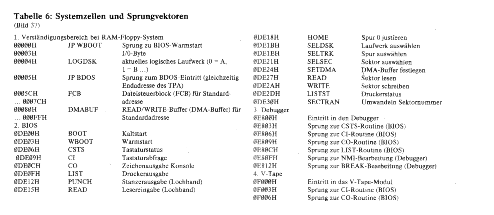

.. index:: pair: PC/M; Systemzellen und Sprungvektoren

Systemzellen und Sprungvektoren
###############################

   Systemzellen und Sprungvektoren

.. index:: triple: PC/M; Systemzellen und Sprungvektoren; Verständigungsbereich

Verständigungsbereich bei RAM-Floppy System
*******************************************

.. .. tabularcolumns:: llL
.. tabularcolumns:: p{0.12\linewidth}p{0.12\linewidth}p{0.56\linewidth}
.. table:: |PC/M| - Verständigungsbereich (|Zero Page|)
   :widths: 15, 15, 70
   :class: longtable
   :align: center
   :width: 80%

   +--------------------+-----------------+-------------------------------------+
   | Adresse            | Symbol          | Beschreibung                        |
   +====================+=================+=====================================+
   | :addr:`00000H`     | :z80:`JP WBOOT` | Sprung zu |BIOS| Warmstart          |
   +--------------------+-----------------+-------------------------------------+
   | :addr:`00003H`     |                 | I/O Byte                            |
   +--------------------+-----------------+-------------------------------------+
   | :addr:`00004H`     | :z80:`LOGDSK`   | aktuelles logisches Laufwerk        |
   |                    |                 |                                     |
   |                    |                 | :code:`0` = :strong:`A`,            |
   |                    |                 | :code:`1` = :strong:`B`,            |
   |                    |                 | :code:`2` = :strong:`C`,            |
   |                    |                 |                                     |
   |                    |                 | |...|                               |
   |                    |                 |                                     |
   |                    |                 | :code:`255` = :strong:`P`           |
   |                    |                 |                                     |
   +--------------------+-----------------+-------------------------------------+
   | :addr:`00005H`     | :z80:`JP BDOS`  | Sprung zum |BDOS| Eintritt          |
   |                    |                 | (gleichzeitig Endadresse des |TPA|) |
   +--------------------+-----------------+-------------------------------------+
   | :addr:`0005CH`     | :z80:`FCB`      | Dateisteuerblock (|FCB|)            |
   | |-| :addr:`0007CH` |                 | Standardadresse                     |
   +--------------------+-----------------+-------------------------------------+
   | :addr:`00080H`     | :z80:`DMABUF`   | READ/WRITE Buffer (|DMA| Buffer)    |
   | |-| :addr:`000FFH` |                 | Standardadresse oder |CCP| Buffer   |
   |                    |                 | der Kommandozeile                   |
   +--------------------+-----------------+-------------------------------------+

.. index:: triple: PC/M; Systemzellen und Sprungvektoren; BIOS

BIOS
****

.. .. tabularcolumns:: llL
.. tabularcolumns:: p{0.12\linewidth}p{0.12\linewidth}p{0.56\linewidth}
.. table:: |PC/M| |BIOS| - Routinen und ihre Einstiegsadressen
   :widths: 15, 15, 70
   :class: longtable
   :align: center
   :width: 80%

   +----------------+----------------+----------------------------+
   | Adresse        | Symbol         | Beschreibung               |
   +================+================+============================+
   | :addr:`0DE00H` | :z80:`BOOT`    | Kaltstart                  |
   +----------------+----------------+----------------------------+
   | :addr:`0DE03H` | :z80:`WBOOT`   | Warmstart                  |
   +----------------+----------------+----------------------------+
   | :addr:`0DE06H` | :z80:`CSTS`    | Tastaturstatus             |
   +----------------+----------------+----------------------------+
   | :addr:`0DE09H` | :z80:`CI`      | Tastaturabfrage            |
   +----------------+----------------+----------------------------+
   | :addr:`0DE0CH` | :z80:`CO`      | Zeichenausgabe Console     |
   +----------------+----------------+----------------------------+
   | :addr:`0DE0FH` | :z80:`LIST`    | Druckerausgabe             |
   +----------------+----------------+----------------------------+
   | :addr:`0DE12H` | :z80:`PUNCH`   | Stanzerausgabe (Lochband)  |
   +----------------+----------------+----------------------------+
   | :addr:`0DE15H` | :z80:`READER`  | Lesereingabe (Lochband)    |
   +----------------+----------------+----------------------------+
   | :addr:`0DE18H` | :z80:`HOME`    | Spur 0 justieren           |
   +----------------+----------------+----------------------------+
   | :addr:`0DE1BH` | :z80:`SELDSK`  | Laufwerk auswählen         |
   +----------------+----------------+----------------------------+
   | :addr:`0DE1EH` | :z80:`SELTRK`  | Spur auswählen             |
   +----------------+----------------+----------------------------+
   | :addr:`0DE21H` | :z80:`SELSEC`  | Sektor auswählen           |
   +----------------+----------------+----------------------------+
   | :addr:`0DE24H` | :z80:`SETDMA`  | |DMA| Buffer festlegen     |
   +----------------+----------------+----------------------------+
   | :addr:`0DE27H` | :z80:`READ`    | Sektor lesen               |
   +----------------+----------------+----------------------------+
   | :addr:`0DE2AH` | :z80:`WRITE`   | Sektor schreiben           |
   +----------------+----------------+----------------------------+
   | :addr:`0DE2DH` | :z80:`LISTST`  | Druckerstatus              |
   +----------------+----------------+----------------------------+
   | :addr:`0DE30H` | :z80:`SECTRAN` | Umwandeln Sektornummer     |
   +----------------+----------------+----------------------------+
   | :addr:`0DE33H` | :z80:`SYSKEN`  | Systemkennung ("AM 02")    |
   +----------------+----------------+----------------------------+

.. index:: triple: PC/M; Systemzellen und Sprungvektoren; Debugger

Debugger
********

.. .. tabularcolumns:: llL
.. tabularcolumns:: p{0.12\linewidth}p{0.12\linewidth}p{0.56\linewidth}
.. table:: |PC/M| |Debugger| - Routinen und ihre Einstiegsadressen
   :widths: 15, 15, 70
   :class: longtable
   :align: center
   :width: 80%

   +----------------+----------------+-----------------------------------------+
   | Adresse        | Symbol         | Beschreibung                            |
   +================+================+=========================================+
   | :addr:`0E800H` | :z80:`SVDBLOC` | Eintritt in den Debugger                |
   +----------------+----------------+-----------------------------------------+
   | :addr:`0E803H` | :z80:`BIOSCS`  | Sprung zur CSTS Routine (BIOS)          |
   +----------------+----------------+-----------------------------------------+
   | :addr:`0E806H` | :z80:`BIOSCI`  | Sprung zur CI Routine (BIOS)            |
   +----------------+----------------+-----------------------------------------+
   | :addr:`0E809H` | :z80:`BIOSCO`  | Sprung zur CO Routine (BIOS)            |
   +----------------+----------------+-----------------------------------------+
   | :addr:`0E80CH` | :z80:`BIOSLS`  | Sprung zur LIST Routine (BIOS)          |
   +----------------+----------------+-----------------------------------------+
   | :addr:`0E80FH` | :z80:`NMIJUM`  | Sprung zur |NMI| Bearbeitung (Debugger) |
   +----------------+----------------+-----------------------------------------+
   | :addr:`0E812H` | :z80:`BRKJUM`  | Sprung zur BREAK Bearbeitung (Debugger) |
   +----------------+----------------+-----------------------------------------+

.. index:: triple: PC/M; Systemzellen und Sprungvektoren; V-Tape

V-Tape
******

.. .. tabularcolumns:: llL
.. tabularcolumns:: p{0.12\linewidth}p{0.12\linewidth}p{0.56\linewidth}
.. table:: |PC/M| |V-Tape| - Routinen und ihre Einstiegsadressen
   :widths: 15, 15, 70
   :class: longtable
   :align: center
   :width: 80%

   +----------------+---------------+--------------------------------+
   | Adresse        | Symbol        | Beschreibung                   |
   +================+===============+================================+
   | :addr:`0F000H` | :z80:`VTAPE`  | Eintritt in das |V-Tape| Modul |
   +----------------+---------------+--------------------------------+
   | :addr:`0F003H` | :z80:`CONIN`  | Sprung zur CI Routine (BIOS)   |
   +----------------+---------------+--------------------------------+
   | :addr:`0F006H` | :z80:`CONOUT` | Sprung zur CO Routine (BIOS)   |
   +----------------+---------------+--------------------------------+

.. Local variables:
   coding: utf-8
   mode: text
   mode: rst
   End:
   vim: fileencoding=utf-8 filetype=rst :
